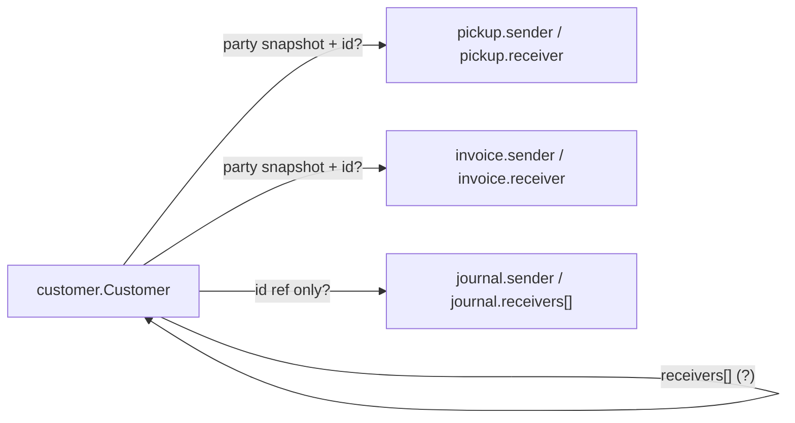
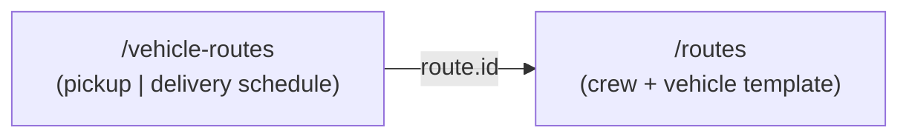

# Backend confirmation requests

**From:** EMSYS Portal frontend  
**Audience:** EMSYS API / backend team  
**Status:** Awaiting backend response

---

## Overview

The portal verified live API behavior against production (`2026-07-09`, company `64d5c0b0d1eab2aaf30b1819`) for **customers**, **routes** (route manager / crew templates), and **vehicle routes** (pickup + delivery schedules). Before broader API cleanup and more portal integration, we need **written confirmation** of these contracts and how they relate to other resources.

**Ask:** Please confirm or correct each section below (inline reply or updated OpenAPI / spec).

**Shared portal code references:**

- `API_PAYLOADS.md`, `API-Query-Usage.md`
- `src/lib/customers/api/customers-api.ts`
- `src/lib/orders/api/orders-api.ts`
- `src/lib/invoices/api/invoices-api.ts`
- `src/lib/pickup-delivery-routes/api/pickup-delivery-routes-api.ts`
- `src/lib/pickup-delivery-routes/types.ts`
- `src/lib/pickup-delivery-routes/filter-fields.ts`
- `src/components/pickup-delivery-routes/pickup-delivery-routes-directory-workspace.tsx`
- `src/lib/route-manager/api/route-manager-api.ts`
- `src/lib/route-manager/types.ts`
- `src/components/route-manager/route-manager-workspace.tsx`
- `src/components/label-updater/label-updater-workspace.tsx`

---

# Part I — Customers

## I.1 Context

Customers are referenced across pickups, invoices, journals, and related directory flows.

**Known portal assumption:** transaction parties hydrate address from `party.address` only (single snapshot), not the full customer `addresses[]` book. Confirm this matches server behavior.

---

## I.2 Canonical `customer.Customer` read model

We believe the canonical **GET** shape is:

```txt
customer.Customer {
  id              ObjectID (24-char hex)
  name            string
  customerType    int        // 1 = Sender, 2 = Receiver — confirm
  phones[]        phone record
  email           string?
  active          bool
  IDNumber        string?
  notes           string?
  accountBalance  number?
  branch          core.BranchDTO { id, name, code }
  addresses[]     address record (primary via isPrimary)
  receivers[]     string[]   // see I.3
  createdAt       datetime
  updatedAt       datetime
  createdBy       core.User { id, name }
  updatedBy       core.User { id, name }
}
```

### Questions

| Question | Why the portal needs it |
| --- | --- |
| Is `customerType` always `1` / `2` on read and write? | Filters, branch defaults, autocomplete |
| Is `receivers[]` an array of **customer ObjectIDs**? | Portal reads it; UI to manage links is not built yet |
| Who can appear in `receivers[]` — only `customerType = 2` records? | Sender → receiver linking UX |
| Is the relationship **directional** (sender → receivers) or bidirectional? | Search, defaults on pickup / invoice |
| Is `accountBalance` authoritative or derived? | Accounting display |
| Are `createdBy` / `updatedBy` always populated on create / update? | Audit display |

---

## I.3 Customer relationships across features

The portal touches customers in several places with **different shapes**. We need one documented relationship contract.



### A. `customer.receivers[]`

- Semantics: “default receivers for this sender”?
- Writable on `POST` / `PUT /customers`?
- Max cardinality? Unique? Validated against company + branch?
- Should the portal expose UI to manage this?

### B. Pickups (`/pickups`)

- Are `sender` and `receiver` **embedded party snapshots**, **refs by `id`**, or both?
- On create, if `sender.id` is sent, does the API copy current customer data or store only the ID?
- Address: is the transaction snapshot **`party.address` only** (not `party.addresses[]`)?
- Search uses `receivers.name`, `receivers.phone`, `receivers.address` but the write payload uses singular `receiver` — is that an intentional search alias?

### C. Invoices (`/invoices`)

- Same party contract as pickups?
- Is `receiver` optional?
- When customer master data changes, do historical invoices update or stay frozen?

### D. Journals / accounting (`/journals`)

- `sender: { id, name }` and `receivers: [{ id, name }]` — refs only, no full snapshot?
- Can `receivers` be multiple while pickup / invoice use a single receiver?

### E. Other resources

Please document whether these reference `customer.id` and how:

| Resource | Customer link (portal expectation) |
| --- | --- |
| Pickups | `sender`, `receiver` (party snapshot) |
| Invoices | `sender`, `receiver` (party snapshot) |
| Journals | `sender`, `receivers[]` (lighter ref?) |
| Containers | Unknown — please document |
| Deliveries | Unknown — please document (see Part II) |
| Routes (`/routes`) | Crew + vehicle template; no customer link (see Part III) |
| Vehicle-routes (`/vehicle-routes`) | Schedule instance; references `/routes` via `route.id` (see Part II) |
| Items (catalog) | No customer link today |

---

## I.4 Legacy field cleanup (deprecation timeline)

Live API still exposes legacy fields. The portal handles them for compatibility.

| Field | Current portal usage | Question for backend |
| --- | --- | --- |
| `phone1`, `phone2` | Required on create write; search OR group | Deprecated? Still required when `phones[]` is sent? |
| `address` (singular) | Fallback on read only | Remove after migration date? |
| `oldID` | Read / display legacy | Still populated for new records? |
| `createdByID` | Read if present | Replace fully by `createdBy.id`? |
| `CustomerType` (PascalCase) | Defensive read | Can we drop? |

**Requested:** deprecation matrix with **read / write / search** support per field and a target removal date.

---

## I.5 Write payload — canonical customer shape

Portal today sends on create / update:

```json
{
  "name": "...",
  "customerType": 1,
  "phone1": "+1...",
  "phones": [
    {
      "type": "mobile",
      "number": "+1...",
      "displayNumber": "...",
      "isPrimary": true
    }
  ],
  "email": "...",
  "active": true,
  "IDNumber": "...",
  "notes": "...",
  "branch": { "id": 1, "code": "NY", "name": "USA" },
  "addresses": [
    {
      "address1": "...",
      "city": "...",
      "state": "...",
      "zipcode": "...",
      "country": "US",
      "isPrimary": true
    }
  ],
  "receivers": ["..."]
}
```

### Questions

- Minimum required fields on create?
- Is `receivers` accepted and validated?
- Are address geo / verification updates only via dedicated endpoints (`PUT .../address/location`, `PUT .../address/google-verification`)?
- Idempotency / duplicate rules (name, phone, `IDNumber`)?

---

# Part II — Vehicle routes (`/vehicle-routes`)

## II.1 Context

Pickup and delivery schedules share **`/v1/vehicle-routes`** and are discriminated by `routeType` (`pickup` | `delivery`).

**Known portal assumptions:**

- Filtered directory lists always use `POST /vehicle-routes/search` with `routeType eq pickup|delivery`.
- Bar search uses API-allowed fields only (`employees.name`, `container.number`, etc.) — not `driver.name` / `container.name`.
- Delivery form lookup uses `date` range + `container.id` + `routeType eq delivery`.
- Write payloads send `employees[]` as source of truth; `driver` / `appraiser` are optional denormalized fields on write.

---

## II.2 Canonical `vehicle_route.VehicleRoute` read model

We believe the canonical **GET** shape is:

```txt
vehicle_route.VehicleRoute {
  id           ObjectID (24-char hex)
  name         string              // server-generated; delivery: "{tripNumber}-{container.number}"
  routeType    string              // "pickup" | "delivery"
  type         string              // duplicate of routeType on live responses — confirm
  active       bool
  date         datetime?           // calendar date; XOR with dayOfWeek
  dayOfWeek    string[]?           // recurring weekdays; XOR with date
  branch       core.BranchDTO { id, name, code }
  route        vehicle_route.RouteRef { id, name, routeId? }  // id = Mongo /routes ObjectID
  container    vehicle_route.ContainerRef? { id, number }     // delivery only
  employees[]  route employee ref { id, name, role }
  driver       route.EmployeeRef?    // read denormalization — confirm
  appraiser    route.EmployeeRef?    // read denormalization — confirm
  tripNumber   int?                  // delivery — confirm stable
  rate         number?               // confirm meaning and stability
  createdAt    datetime?
  createdBy    string | core.User?
  updatedAt    datetime?
  updatedBy    string | core.User?
}
```

### Questions

| Question | Why the portal needs it |
| --- | --- |
| Is `type` a legacy alias of `routeType`? Can it be dropped from reads? | Normalization, docs |
| Are `driver` / `appraiser` always derived from `employees[]` on read? | Display vs search field naming |
| Is `tripNumber` always set on delivery routes? Auto-assigned on create only? | Table column, filters, naming |
| What is `rate`? User-set, computed, or legacy? | Whether to expose in UI / filters |
| Are audit fields guaranteed on **list** responses or detail-only? | Directory columns |
| Is `route.routeId` populated and searchable via `route.id` only? | Route manager linking |

---

## II.3 `/vehicle-routes` vs legacy `/deliveries`

Two resources appear in API docs:

| Resource | Path | ID type | Portal usage today |
| --- | --- | --- | --- |
| Vehicle route (delivery) | `POST /vehicle-routes` (`routeType: delivery`) | ObjectID | **Primary** — delivery routes workspace |
| Legacy delivery | `POST /deliveries` | `uint32` | Not used in directory; referenced by reports types |

### Questions

| Question | Why the portal needs it |
| --- | --- |
| Is `/deliveries` deprecated in favor of `/vehicle-routes`? | Migration / cleanup |
| Does creating a vehicle-route delivery auto-create or sync a `/deliveries` row? | Report IDs, barcodes |
| What should barcodes / invoices link to for delivery context? | Cross-feature refs |
| Can we remove `/deliveries` from new portal flows? | Architecture |

---

## II.4 Search & filter contract (`POST /vehicle-routes/search`)

Verified live search allowlist (2026-07-09):

```txt
active, branch.code, branch.id, branch.name,
container.id, container.number,
date, dayOfWeek,
employees.id, employees.name, employees.role,
id, name, rate,
route.id, route.name,
routeType, tripNumber
```

**Rejected** (400 `QUERY_FIELD_NOT_ALLOWED`): `driver.name`, `appraiser.name`, `helper.name`, `container.name`

Operators: `eq`, `neq`, `contains`, `startsWith`, `in`, `notIn`, `gt`, `gte`, `lt`, `lte`

### Questions

| Question | Why the portal needs it |
| --- | --- |
| Is the allowlist above authoritative and complete? | Advanced filter UI |
| Will `driver.name` / `appraiser.name` ever be added, or is `employees.name` permanent? | Bar search fields |
| Should `container.name` alias `container.number` in search? | UX parity with read model |
| Date filters: is `YYYY-MM-DD` always valid, or must clients send ISO UTC (`…T00:00:00Z`)? | Filter builder |
| What is the difference between pagination `total` and `subtotal`? | Pagination display |
| Allowed `sort` fields for directory tables? | Column sort (currently disabled in UI) |

**Portal bar search fields (aligned to allowlist):**

`name`, `route.name`, `employees.name`, `container.number`, `date`, `tripNumber`

---

## II.5 Write payload & business rules

### Confirmed portal write shape (delivery example)

```json
{
  "routeType": "delivery",
  "active": true,
  "branch": { "id": 2, "code": "RD" },
  "date": "2026-12-29T00:00:00Z",
  "route": { "id": "6a48a2bdf48987026931c91e", "name": "ALEJANDRO,ALEX-camino RD" },
  "employees": [
    { "id": 110, "name": "ALEJANDRO", "role": "driver" },
    { "id": 34, "name": "ALEX", "role": "helper" }
  ],
  "container": { "id": 1362, "number": "35-26" }
}
```

Live create behavior: server sets `name` (e.g. `"13-35-26"`) and `tripNumber` (e.g. `13`).

### Questions

| Question | Why the portal needs it |
| --- | --- |
| `date` XOR `dayOfWeek` — enforced on create/update? | Form validation |
| Delivery: is `container` required on every write? | Form validation |
| Pickup: is `container` forbidden on write? | Form validation |
| Can clients set `tripNumber` on create/update, or server-only? | Edit form |
| Uniqueness: multiple routes per `date + container.id` with different `tripNumber` — intentional? | Add-route UX (live data shows trips 1–5 same container/day) |
| What happens on duplicate create (same date + container, no trip override)? | Error handling |
| Is pickup `name` optional (server-generated when empty)? Delivery `name` always server-generated? | Form — already assumed |
| Are `driver` / `appraiser` on write optional if `employees[]` is complete? | Payload minimization |

---

## II.6 Reports & print actions

Delivery routes workspace prints via:

```json
POST /reports/deliveries
{
  "type": "delivery",
  "collection": "deliveries",
  "values": ["<id>"],
  "lookupField": "id"
}
```

Portal currently passes **vehicle-route ObjectIDs** (e.g. `6a4c498a5b044b685c830b56`).

`API_PAYLOADS.md` and `ReportRequest` examples use **numeric** `/deliveries` ids (e.g. `"1001"`).

Pickup manifest uses pickup **order** ids (`collection: "pickups"`), not vehicle-route ids — verified pattern differs.

### Questions

| Question | Why the portal needs it |
| --- | --- |
| Does `POST /reports/deliveries` accept vehicle-route ObjectIDs? | Print button on delivery routes |
| If not, how do we resolve vehicle-route → delivery id for reports? | Print integration |
| Should `collection` be `vehicle-routes` for delivery reports? | Report API contract |
| Permission required for delivery reports — `vehicle_route`, `delivery`, or both? | Auth guards |

---

## II.7 Permissions & endpoints

| Method | Path | Permission (OpenAPI) | Portal usage |
| --- | --- | --- | --- |
| GET | `/vehicle-routes` | `vehicle_route` | Unfiltered list (mixed types); portal prefers search |
| POST | `/vehicle-routes` | `vehicle_route` | Create |
| GET | `/vehicle-routes/{id}` | `vehicle_route` | Detail / edit load |
| PUT | `/vehicle-routes/{id}` | `vehicle_route` | Update |
| DELETE | `/vehicle-routes/{id}` | `vehicle_route` | Delete |
| POST | `/vehicle-routes/search` | `vehicle_route` | Directory list + filters |

There are **no** separate `/pickup-routes` or `/delivery-routes` endpoints.

### Questions

- Does `vehicle_route` permission cover both pickup and delivery schedules for all company users who need them?
- Any branch-scoped restrictions (portal locks delivery UI to branch code `RD`)?

---

## II.8 Portal gaps pending backend answers

| Item | Blocked on |
| --- | --- |
| Delivery **Print** action | II.6 — correct report id type |
| **`tripNumber` table column** | II.2 — stable read field |
| **`rate` in UI** | II.2 — field meaning |
| Column **sort** on directory | II.4 — allowed sort fields |
| Update `API_PAYLOADS.md` search allowlist | II.4 confirmation |
| Deprecate `/deliveries` in portal | II.3 confirmation |

---

# Part III — Routes (`/routes`)

## III.1 Context

The **Route Manager** workspace manages **`/v1/routes`**: reusable crew + vehicle assignments (templates). Pickup and delivery **schedules** live on **`/v1/vehicle-routes`** and reference a route via `route.id` (Mongo ObjectID from `/routes`).

`API_PAYLOADS.md` states that `name` and `routeId` are server-generated on create and that **date belongs on pickup/delivery routes, not routes**. The portal still models `date`, `routeId`, and `tripNumber` on `/routes` and uses date-scoped search for KPIs — we need alignment.

**Known portal assumptions (may be wrong):**

- Filtered directory lists use `POST /routes/search` when the user types in the bar or selects a branch.
- Bar search OR group includes `routeId` (see III.4 — **rejected live**).
- Branch filter uses `vehicle.branch eq <code>`; routes also return a top-level `branch` object on read.
- Create / update require `branch`, `vehicle`, `employees[]`, and `active`.
- Label updater and barcode assignment use a route identifier — portal currently prefers `routeId` but barcodes API path uses Mongo `id`.

---

## III.2 Canonical `route.Route` read model

Live **GET** shape observed (`2026-07-09`):

```txt
route.Route {
  id           ObjectID (24-char hex)
  name         string              // server-generated, e.g. "MIGUEL,Basilio-Camion 3"
  branch       core.BranchDTO { id, name, code }
  vehicle      route.VehicleRef { id, name, branch }
  employees[]  route.EmployeeRef { id, name, role }
  active       bool
  createdAt    datetime
  updatedAt    datetime?
  createdBy    string | core.User?
  updatedBy    string | core.User?
}
```

**Not returned live** (but present in portal types / `API_PAYLOADS.md`):

```txt
routeId?       string    // human code, e.g. "ras-…" — docs say server-generated
date?          datetime  // docs say belongs on vehicle-routes, not routes
tripNumber?    int       // portal type only; may belong on vehicle-routes / barcodes
```

### Questions

| Question | Why the portal needs it |
| --- | --- |
| Is `/routes` a **dateless template** and `/vehicle-routes` the **dated schedule**? | Domain model, KPIs, UI columns |
| Will `routeId` be returned on create / read? If yes, format and uniqueness rules? | View sheet, label updater, search |
| If `routeId` is deprecated, should clients use Mongo `id` + `name` only? | Remove portal field / search |
| Are `date` and `tripNumber` intentionally absent from `/routes`? | Remove from portal `Route` type |
| Is top-level `branch` authoritative, or is `vehicle.branch` the source of truth? | Branch filter + form scoping |
| Are `employees[].role` values persisted (`driver`, `appraiser`, `helper`)? Older rows show all `helper`. | Crew role UI on create / update |
| Are audit fields guaranteed on **list** responses? | Directory columns |

---

## III.3 `/routes` vs `/vehicle-routes` relationship



`API_PAYLOADS.md` pickup example:

```json
"route": { "id": "674a1b2c3d4e5f6789012346", "name": "Jane Driver-Vehicle 1" }
```

### Questions

| Question | Why the portal needs it |
| --- | --- |
| Confirm: one `/routes` record can be referenced by many `/vehicle-routes`? | Route picker, schedules |
| On vehicle-route create, is `route.id` required? Is `route.name` optional denormalization? | Pickup / delivery forms |
| Should portal **KPIs** (“routes today”) query `/vehicle-routes/search` by `date`, not `/routes`? | `useRouteKpis` / `fetchRoutesByDate` |
| Does deleting a `/routes` record block or cascade to linked vehicle-routes? | Delete confirmation UX |

---

## III.4 Search & filter contract (`POST /routes/search`)

Verified live search allowlist (`2026-07-09`):

```txt
active, branch.code, branch.id, branch.name,
createdAt, createdBy,
employees.id, employees.name, employees.role,
id, name,
updatedAt, updatedBy,
vehicle.branch, vehicle.id, vehicle.name
```

**Rejected** (400 `QUERY_FIELD_NOT_ALLOWED`): `routeId`, `date`

Operators: `eq`, `neq`, `contains`, `startsWith`, `in`, `notIn`, `gt`, `gte`, `lt`, `lte`

### Questions

| Question | Why the portal needs it |
| --- | --- |
| Is the allowlist above authoritative and complete? | Advanced filter UI |
| Will `routeId` be added to the search allowlist? | Bar search (portal sends it today → **400**) |
| Will `date` ever be searchable on `/routes`, or only on `/vehicle-routes`? | `fetchRoutesByDate` |
| Branch filter: prefer `branch.code` or `vehicle.branch`? Both work live. | Align portal filter field |
| Date / datetime filters: `YYYY-MM-DD` vs ISO UTC (`…T00:00:00Z`)? | Filter builder |
| Allowed `sort` fields for `GET /routes` and search body? Portal default is `date:desc`. | List ordering |
| Does `GET /routes?sort=date:desc` sort by a real field, or is it ignored? | Default list behavior |
| `total` vs `subtotal` on search responses? | Pagination display |

**Portal bar search fields today (misaligned — includes rejected field):**

`name`, `routeId`, `vehicle.name`, `employees.name`

**Portal bar search fields if `routeId` stays rejected:**

`name`, `vehicle.name`, `employees.name`

---

## III.5 Write payload & business rules

`API_PAYLOADS.md` create example omits `branch` and `active`; live API **requires** branch and employees.

### Confirmed portal write shape (verified live create 201)

```json
{
  "branch": { "id": 1, "code": "NY", "name": "Embarque Tenares" },
  "vehicle": { "id": "6a412cceb2f8ec04b0ee78e8", "name": "Camion 3", "branch": "NY" },
  "employees": [
    { "id": 1, "name": "MIGUEL", "role": "driver" },
    { "id": 157, "name": "Basilio", "role": "helper" }
  ],
  "active": true
}
```

Live create behavior: server sets `name` (e.g. `"MIGUEL,Basilio-Camion 3"`). **`routeId` not returned.**

Validation errors observed:

- Missing `branch` → **400** `"route branch id and name are required"`
- Empty `employees` → **400** `"route employees are required"`

### Questions

| Question | Why the portal needs it |
| --- | --- |
| Minimum required fields on create / update? | Form validation, update `API_PAYLOADS.md` |
| Is `name` always server-generated on create? Can clients override on `PUT`? | Edit form |
| Is `routeId` generated but not yet exposed in responses? | Portal display / search |
| Valid `employees[].role` values and cardinality rules (one driver, one appraiser)? | Crew role UI |
| Must `vehicle.branch` match `branch.code`? | Branch + vehicle picker scoping |
| Uniqueness rules (same vehicle + same employees + same branch)? | Duplicate prevention |
| Delete: hard delete or soft (`active: false`)? Observed hard delete (404 after). | Delete UX |

---

## III.6 Cross-feature route references

The portal references `/routes` from several features. We need one documented identifier contract.

| Feature | Portal usage today | Question for backend |
| --- | --- | --- |
| Vehicle-routes | `route.id` = Mongo ObjectID from `/routes` | Confirmed? |
| Label updater | `PUT /invoices/item/barcode/route/{routeId}` — portal passes `routeId` field | **Which id goes in the path — Mongo `id` or human `routeId`?** |
| Invoices (pickup source) | Uses **vehicle-routes** (`pickupRouteOptions`), not `/routes` | Confirm invoice `routeId` is vehicle-route id |
| Orders | `route.id` filter on orders search | Maps to vehicle-route or `/routes`? |
| Accounting / journals | `routeId` on entries | Which resource id type? |

---

## III.7 Permissions & endpoints

| Method | Path | Permission (`API_PAYLOADS.md`) | Portal usage |
| --- | --- | --- | --- |
| GET | `/routes` | `route` | Unfiltered list |
| POST | `/routes` | `route` | Create |
| GET | `/routes/{id}` | `route` | Detail / edit load |
| PUT | `/routes/{id}` | `route` | Update |
| DELETE | `/routes/{id}` | `route` | Delete |
| POST | `/routes/search` | `route` | Directory list when filtered |

### Questions

- Does `route` permission cover route manager for all branches the user can access?
- Any branch-scoped restrictions beyond `x-company-id`?

---

## III.8 Portal gaps pending backend answers

| Item | Blocked on |
| --- | --- |
| **Routes bar search** (text query) | III.4 — `routeId` in OR group → **400** today |
| **Route view sheet `routeId` / `date` columns** | III.2 — fields not in live response |
| **`fetchRoutesByDate` / `useRouteKpis`** | III.3 — should query `/vehicle-routes`? |
| **Label updater route select** | III.6 — Mongo `id` vs `routeId` for barcode assign |
| **Default sort `date:desc`** | III.4 — `date` not on resource |
| Update `API_PAYLOADS.md` routes section | III.5 — `branch`, `active`, roles, search allowlist |

---

# Cross-cutting — Search & filter standardization

Verified working on **customers** and **vehicle routes**:

| Resource | Unfiltered list | Filtered list | Autocomplete |
| --- | --- | --- | --- |
| Customers | `GET /customers` | `POST /customers/search` | `GET /customers/autocomplete` |
| Vehicle routes | `GET /vehicle-routes` (mixed types) | `POST /vehicle-routes/search` | — |

Please confirm as standard for list resources the portal uses today (`customers`, `pickups`, `invoices`, `employees`, `vehicles`, `containers`, `deliveries`, `journals`, `vehicle-routes`, etc.):

| Topic | Proposal |
| --- | --- |
| Filtered lists | Always `POST /<resource>/search` with pagination in query string |
| Unfiltered lists | `GET /<resource>?page&limit&offset&sort` |
| Single simple filter on GET | `field`, `operator`, `value` query params — still supported? |
| Bar search body | Root `operator: "and"` + inner `or` group across alias fields |
| Customer address search | Virtual paths: `address.*`, `addresses.*` — document canonical set |
| Phone search | `phones.number`, `phone1`, `phone2` — document canonical set |
| Pickup search aliases | `receivers.*` for search vs `receiver` on write — document mapping |
| Vehicle-route crew search | `employees.name` for search vs `driver` / `appraiser` on read — document mapping |
| Search allowlist errors | Return `QUERY_FIELD_NOT_ALLOWED` with `allowedFields` — standard everywhere? |
| Pagination | Document `total` vs `subtotal` semantics |

**Deliverable:** one shared “Advanced Search” spec applied across transaction and directory resources (not resource-specific surprises).

---

# Requested deliverables from backend

1. **Written answers** to Part I and Part II (inline on this doc or linked spec).
2. **Updated API spec** (`OpenAPI` or equivalent) with:
   - canonical `customer.Customer` and `vehicle_route.VehicleRoute`
   - party snapshot DTO used by pickups / invoices
   - `receivers[]` semantics on customer and journal
   - search field alias tables (pickup `receiver` vs `receivers.*`; vehicle-route crew fields)
   - `POST /vehicle-routes/search` allowlist (authoritative)
   - `tripNumber` / `rate` semantics
   - `/deliveries` vs `/vehicle-routes` relationship and deprecation plan
   - `POST /reports/deliveries` accepted id types and `collection` values
   - legacy deprecation notes
3. **Relationship diagram** for Customer ↔ Pickup ↔ Invoice ↔ Journal.
4. **Sample payloads** for:
   - sender with linked receivers on `customer.receivers[]`
   - pickup create referencing an existing customer + specific address
   - invoice with frozen party snapshot after customer master data changes
   - delivery create with auto `tripNumber` and `name`
   - multiple trips same container + date
   - search by `employees.name` and `container.number`
   - successful delivery report from vehicle-route id

---

# Highest-priority questions (if only six answers)

**Customers**

1. **What does `customer.receivers[]` mean, and is it writable?**
2. **Are pickup / invoice parties snapshots, refs, or both — and which fields are frozen?**
3. **What is the canonical search vs write naming for receiver fields (`receiver` vs `receivers.*`)?**

**Vehicle routes**

4. **`POST /reports/deliveries` — vehicle-route ObjectIDs or legacy `/deliveries` numeric ids?**
5. **`/deliveries` vs `/vehicle-routes` (delivery) — which is canonical going forward?**
6. **Multi-trip rules: same `date + container.id` with different `tripNumber` — how are duplicates handled on create?**

---

# Portal verification log

## Customers

| Check | Endpoint | Result |
| --- | --- | --- |
| List | `GET /customers` | 200 |
| Create | `POST /customers` | 201 |
| Read | `GET /customers/{id}` | 200 |
| Update | `PUT /customers/{id}` | 200 |
| Delete | `DELETE /customers/{id}` | 200 |
| Bar / advanced search | `POST /customers/search` | 200 |
| Autocomplete | `GET /customers/autocomplete` | 200 |

## Vehicle routes

| Check | Endpoint | Result |
| --- | --- | --- |
| List (unfiltered) | `GET /vehicle-routes` | 200 — mixed pickup + delivery |
| List (delivery) | `POST /vehicle-routes/search` + `routeType eq delivery` | 200 |
| Bar search (aligned fields) | `POST /vehicle-routes/search` OR group | 200 |
| Bar search (legacy fields) | `driver.name`, `container.name` in OR group | **400** `QUERY_FIELD_NOT_ALLOWED` |
| Advanced filters | `date gte`, `container.id`, `tripNumber`, `active`, `employees.role`, etc. | 200 |
| Read | `GET /vehicle-routes/{id}` | 200 |
| Create | `POST /vehicle-routes` | 201 — server sets `name`, `tripNumber` |
| Update | `PUT /vehicle-routes/{id}` | 200 |
| Delete | `DELETE /vehicle-routes/{id}` | 200 |
| Delivery lookup | search `date` range + `container.id` + `routeType` | 200 |
| Delivery print | `POST /reports/deliveries` with vehicle-route id | **Not verified** |

_Filtered directory lists in the portal use `POST /<resource>/search`, not legacy GET filter params._

---

# Backend response

_Use this section for answers. Date and author optional._

| Section | Answered | Notes |
| --- | --- | --- |
| I.2 Customer read model | | |
| I.3 Customer relationships | | |
| I.4 Legacy cleanup | | |
| I.5 Customer write payload | | |
| II.2 Vehicle route read model | | |
| II.3 `/deliveries` vs vehicle-routes | | |
| II.4 Vehicle route search & filters | | |
| II.5 Vehicle route write rules | | |
| II.6 Reports | | |
| II.7 Permissions | | |
| Cross-cutting search standardization | | |

---

_Update this document when the backend team responds or when API contracts change._
