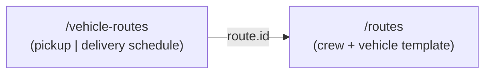
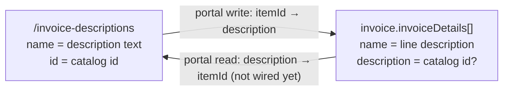
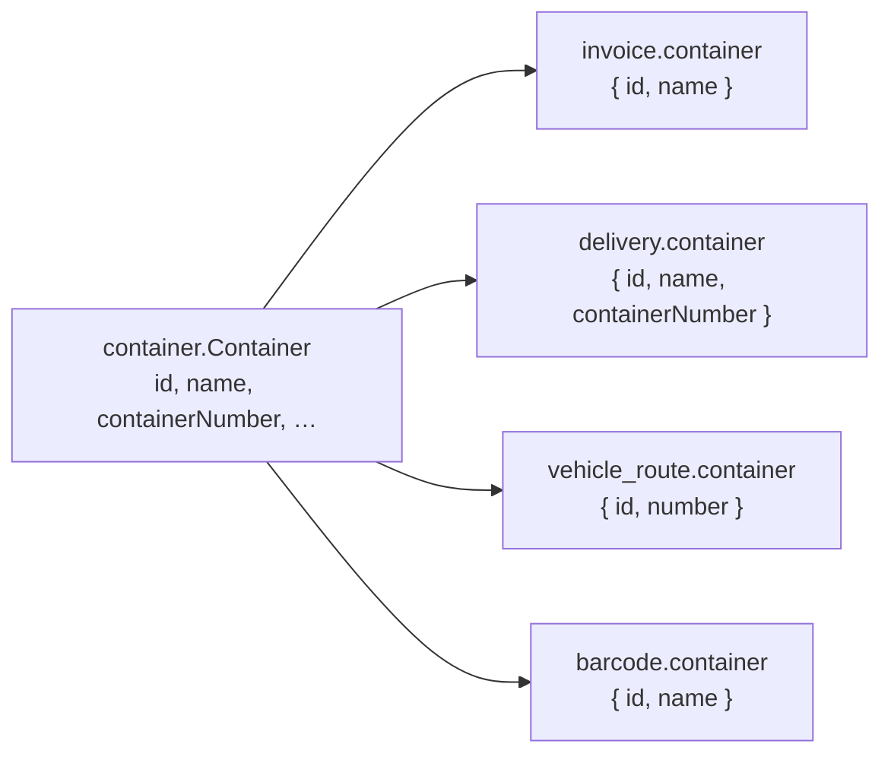
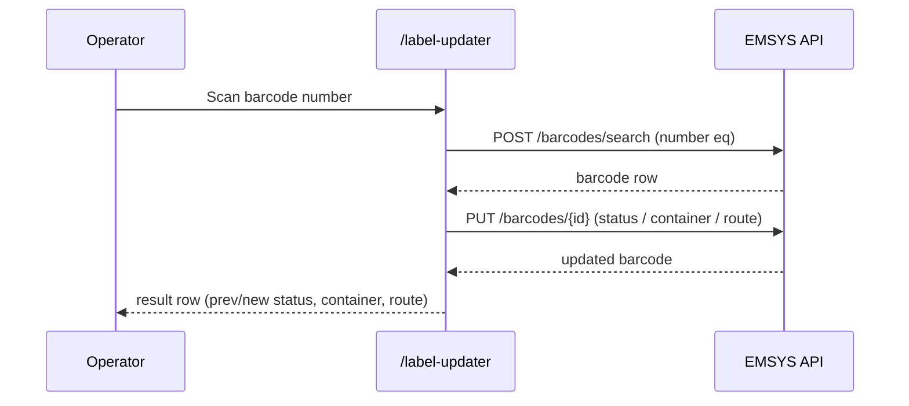

# Backend confirmation requests

**From:** EMSYS Portal frontend  
**Audience:** EMSYS API / backend team  
**Status:** Partially confirmed — see **Confirmed decisions (backend must implement)** below. Remaining sections still need written answers.

---

## Overview

The portal verified live API behavior against production (`2026-07-09`, company `64d5c0b0d1eab2aaf30b1819`) for **customers**, **pickups**, **invoices**, **containers**, **invoice descriptions** (items catalog), **routes** (route manager / crew templates), **vehicle routes** (pickup + delivery schedules), and **barcodes** (directory + barcode scanner). Before broader API cleanup and more portal integration, we need **written confirmation** of these contracts and how they relate to other resources.

**Audit metadata goal:** Every directory / transaction resource the portal lists should expose the same four fields on **list, read, and mutation responses**:

```txt
createdAt    datetime
updatedAt    datetime
createdBy    core.User { id, name }
updatedBy    core.User { id, name }
```

Search should allow `createdAt`, `updatedAt`, `createdBy.name`, and `updatedBy.name` wherever audit columns are shown. See **Cross-cutting — Audit metadata** below for the current gap matrix.

**Ask:** Please confirm or correct each **open** section below (inline reply or updated OpenAPI / spec).

**Backend alignment required (confirmed YES — implement, migrate, publish spec):**

1. **All resources** in the gap matrix adopt the same `core.User { id, name }` shape for `createdBy` / `updatedBy` on list, read, and mutations.
2. **Pickups + invoices:** retire `user` / `employee` as creator substitutes; migrate historical data into `createdBy` / `updatedBy`.
3. **Customers:** deprecate `createdByID` → use `createdBy.id`; migrate existing rows. **Full customer pack:** [`CUSTOMER_BACKEND_CONFIRMATION.md`](./CUSTOMER_BACKEND_CONFIRMATION.md).
4. **Vehicle-routes search:** add `createdAt`, `updatedAt`, `createdBy.name`, `updatedBy.name` to `POST /vehicle-routes/search` allowlist.
5. **Customers `receivers[]`:** only `customerType = 2` (Receiver) records may appear. Details in [`CUSTOMER_BACKEND_CONFIRMATION.md`](./CUSTOMER_BACKEND_CONFIRMATION.md).
6. **Routes domain model:** `/routes` = dateless template; `/vehicle-routes` = dated schedule; `routeId` returned on create/read; `date` searchable only on vehicle-routes; KPIs query `/vehicle-routes/search` by date.
7. **Vehicle-route crew:** `driver` / `appraiser` are separate fields (set on create/edit), not derived from `employees[]`; `employees[].role` is the employee's job role — distinct from route crew roles.
8. **Invoice descriptions:** search adds `createdBy.name` / `updatedBy.name`; delete allowed when referenced (existing invoices keep snapshot); `price: 0` valid; dedicated items permission.

See **Confirmed decisions (backend must implement)** for full action items.

**Shared portal code references:**

- `API_PAYLOADS.md`, `API-Query-Usage.md`
- `src/lib/customers/api/customers-api.ts`
- `src/lib/orders/api/orders-api.ts`
- `src/lib/invoices/api/invoices-api.ts`
- `src/lib/pickup-delivery-routes/api/pickup-delivery-routes-api.ts`
- `src/lib/pickup-delivery-routes/types.ts`
- `src/lib/pickup-delivery-routes/filter-fields.ts`
- `src/components/pickup-delivery-routes/pickup-delivery-routes-directory-workspace.tsx`
- `src/lib/route-manager/api/route-manager-api.ts`
- `src/lib/route-manager/types.ts`
- `src/components/route-manager/route-manager-workspace.tsx`
- `src/components/label-updater/label-updater-workspace.tsx`
- `src/lib/labels/api/label-updater-api.ts`
- `src/lib/labels/api/barcodes-api.ts`
- `src/lib/labels/types.ts` — `BARCODE_STATUS_OPTIONS` (scanner status catalog)
- `src/lib/barcodes/api/barcodes-catalog-api.ts`
- `src/lib/barcodes/types.ts`
- `src/lib/barcodes/filter-fields.ts`
- `src/lib/barcodes/search-fields.ts`
- `src/components/barcodes/barcodes-workspace.tsx`
- `scripts/probe-barcodes-live.mjs`
- `src/lib/items/api/items-api.ts`
- `src/lib/items/types.ts`
- `src/lib/items/filter-fields.ts`
- `scripts/probe-invoice-descriptions-live.mjs`
- `src/lib/containers/api/containers-api.ts`
- `src/lib/containers/types.ts`
- `src/lib/containers/filter-fields.ts`
- `src/lib/containers/search-fields.ts`
- `scripts/probe-containers-live.mjs`
- `scripts/probe-pickups-live.mjs`
- `scripts/probe-pickups-filters.mjs`
- `scripts/probe-invoices-api.mjs`
- `scripts/probe-invoices-model.mjs`
- `scripts/probe-pickup-routes-live.mjs`

---

# Cross-cutting — Audit metadata (`createdAt`, `updatedAt`, `createdBy`, `updatedBy`)

## Target contract (all resources below)

```txt
createdAt    datetime          // set on create; never null on read after create
updatedAt    datetime          // set on create; refreshed on every update
createdBy    core.User         // { id, name } — authenticated user on create
updatedBy    core.User         // { id, name } — authenticated user on last update
```

**Search:** `createdAt`, `updatedAt`, `createdBy.name`, `updatedBy.name` (and `createdBy.id` / `updatedBy.id` where useful).

**Not acceptable long-term:** legacy numeric-only `createdByID`, plain-string actor names, `user` / `employee` substitutes for `createdBy`, or search-only virtual paths with no matching read field.

---

## Confirmed decisions (backend must implement)

The following are **confirmed YES**. The API/backend team must align all resources, migrate existing data where needed, and publish an updated spec.

### 1. Universal `core.User` audit shape

**Decision:** Every resource in the gap matrix below must adopt the **same** `core.User { id, name }` shape for `createdBy` and `updatedBy` on **list, read, and mutation responses**.

**Backend action:**

- Return `createdBy` and `updatedBy` as `core.User` objects everywhere — never plain strings, never numeric-only IDs alone.
- Guarantee all four audit fields on list rows (not detail-only).
- Return all four fields on create/update mutation responses.

### 2. Retire legacy actor fields on pickups and invoices

**Decision:** `user` and `employee` as **creator substitutes** are **retired** for pickups and invoices.

| Resource     | Retire on read/write            | Replace with              |
| ------------ | ------------------------------- | ------------------------- |
| **Pickups**  | `user`                          | `createdBy` / `updatedBy` |
| **Invoices** | `user`, `employee` (as creator) | `createdBy` / `updatedBy` |

**Backend action:**

- Stop returning `user` on pickup reads; `createdBy` is canonical (already live on pickups — enforce everywhere).
- Stop returning `user` / `employee` as creator on invoice reads; expose `createdBy` / `updatedBy` instead.
- **Migrate stored data** so historical records populate `createdBy` / `updatedBy` from legacy `user` / `employee` where applicable.
- Remove or hard-deprecate legacy fields after migration window; document removal date in OpenAPI.
- Search aliases (`createdBy.name`, `updatedBy.name`) must match read field names — no search-only virtual paths.

**Note:** Invoice `employee` as the **assigned appraiser/tasador** (business role on the invoice) may remain a separate concept from `createdBy` — please confirm in VII.2 if a distinct `employee` ref is still required for that role after audit cleanup.

### 3. Retire `createdByID` on customers

**Decision:** `createdByID` (numeric) is **deprecated** in favor of `createdBy.id` (`core.User`).

**Backend action:**

- Ensure `createdBy` / `updatedBy` are always populated on customer list + read + mutations.
- Migrate existing rows: `createdBy.id` ← legacy `createdByID` where needed.
- Mark `createdByID` deprecated in spec; remove after migration window.

**Full customer confirmation (read model, relationships, write payload, verification log):** see [`CUSTOMER_BACKEND_CONFIRMATION.md`](./CUSTOMER_BACKEND_CONFIRMATION.md).

### 4. Vehicle-routes search audit allowlist

**Decision:** `POST /vehicle-routes/search` **will add** these fields to the search/sort allowlist:

```txt
createdAt, updatedAt, createdBy.name, updatedBy.name
```

(Also support `createdBy.id` / `updatedBy.id` if consistent with other resources.)

**Backend action:**

- Add fields to search allowlist and document in OpenAPI.
- Ensure matching `createdBy` / `updatedBy` `core.User` objects are returned on vehicle-route **list** rows (today optional/inconsistent — see II.2).
- Normalize `createdBy` / `updatedBy` on read from `string | core.User` to **`core.User` only**.

### 5. Customer `receivers[]` membership

**Decision:** Only customers with **`customerType = 2` (Receiver)** may appear in `receivers[]`.

**Backend action:**

- Validate on `POST` / `PUT /customers` that every id in `receivers[]` references a Receiver customer.
- Document in OpenAPI; return clear validation error on violation.

Details and open questions: [`CUSTOMER_BACKEND_CONFIRMATION.md`](./CUSTOMER_BACKEND_CONFIRMATION.md).

### 6. Routes vs vehicle-routes domain model

**Decision:** `/routes` is a **dateless crew + vehicle template**; `/vehicle-routes` is the **dated schedule** (pickup or delivery).

| Topic | Confirmed |
| --- | --- |
| One `/routes` record referenced by many `/vehicle-routes` | **YES** |
| `routeId` returned on create / read | **YES** — backend to document format and uniqueness rules in OpenAPI |
| `date` searchable on `/routes` | **NO** — only on `/vehicle-routes` |
| Portal KPIs (“routes today”) | Query **`POST /vehicle-routes/search` by `date`**, not `/routes` |
| Delete `/routes` | Does **not** affect **historical** vehicle-routes; **blocks future** schedules linked to that template |
| Branch source of truth | **`vehicle.branch`** — not top-level `branch` on `/routes` |
| Uniqueness on `/routes` create | **YES** — same vehicle + same employees + same branch is a duplicate |

**Backend action:**

- Return `routeId` on `/routes` create and read responses (live gap today).
- Add `routeId` to search allowlist or document canonical search field.
- Enforce uniqueness rule on create/update.
- Document delete behavior (historical vs future vehicle-routes).

**Portal action:** Remove `date` / `tripNumber` from `/routes` types; point `useRouteKpis` / `fetchRoutesByDate` at `/vehicle-routes/search`; prefer `vehicle.branch` for branch scoping.

### 7. Vehicle-route crew, `rate`, and branch shape

**Decision:** Route crew roles (`driver`, `appraiser`, `helper` on a schedule) are **not** modeled via `employees[].role`. They are set explicitly on create/edit.

| Topic | Confirmed |
| --- | --- |
| `driver` / `appraiser` derived from `employees[]` on read? | **NO** — decided on creation/edit of delivery or pickup route |
| One employee is both driver + appraiser | **`employees[]` unchanged** — use separate top-level **`driver`** and **`appraiser`** fields (not duplicate `employees[]` rows, not `role` on employee refs) |
| `driver` / `appraiser` on write optional if `employees[]` complete? | **YES** |
| `employees[].role` on `/routes` and `/vehicle-routes` | **Employee job role** — **different** from delivery/pickup route roles (`driver` / `appraiser` / `helper`). Backend to confirm persisted values and cardinality in OpenAPI. |
| `rate` | **User-set** on creation/edit — portal must expose editable `rate` field |
| `branch.name` on vehicle-route read | **Required** — must not be optional on any schedule type |

**Backend action:**

- Migrate read/write model: top-level `driver` and `appraiser` refs are canonical for route crew assignment; stop overloading `employees[].role` for driver/appraiser/helper on schedules.
- Always return `branch.name` on vehicle-route reads.
- Document `rate` as user-editable numeric field.
- **Open item for backend:** confirm exact `employees[].role` enum (employee job role) vs route crew fields — portal will treat them as separate concepts.

**Portal action:** Align pickup/delivery route forms with user-set `rate`; use `driver` / `appraiser` fields; do not infer crew from `employees[].role`.

### 8. Invoice descriptions (`/invoice-descriptions`)

| Topic | Confirmed |
| --- | --- |
| `POST /invoice-descriptions/search` allows `createdBy.name`, `updatedBy.name` | **YES** — add to allowlist |
| Delete when referenced by invoices | **Allowed** — must **not** erase from existing invoices; affects **future** invoice line picks only |
| `price: 0` valid | **YES** |
| Permission | **Dedicated items permission** — not `invoice` permission |

**Backend action:**

- Add `createdBy.name`, `updatedBy.name` (and `createdBy` / `updatedBy` on read per §1) to search allowlist and read model.
- Document delete semantics: historical invoice lines keep catalog id + snapshot text.
- Document dedicated permission name in OpenAPI.

**Portal action:** Gate items workspace with dedicated items permission when backend exposes it.

---

## Gap matrix (live API, `2026-07-09`)

| Resource                   | Endpoint                                  | `createdAt`              | `updatedAt`                | `createdBy`                                                              | `updatedBy`                                            | Portal notes                                                                      |
| -------------------------- | ----------------------------------------- | ------------------------ | -------------------------- | ------------------------------------------------------------------------ | ------------------------------------------------------ | --------------------------------------------------------------------------------- | --------------------------------------------------------- |
| **Customers**              | `/customers`                              | ✅                       | ✅                         | ⚠️ Target: `core.User` — `**createdByID` deprecated\*\* → `createdBy.id` | ⚠️ Target: `core.User` on read                         | Portal still maps `createdByID` only — update after backend migration             |
| **Pickups**                | `/pickups`                                | ✅                       | ✅                         | ✅ `createdBy` on list + GET                                             | ✅ `updatedBy` when updated                            | `**user` retired\*\* (confirmed). Portal bug: client still maps `user` — see VI.5 |
| **Invoices**               | `/invoices`                               | ✅                       | ✅                         | ⚠️ Live: `user`/`employee` — **target: `createdBy`**                     | ⚠️ Live: search only — **target: `updatedBy` on read** | Backend to migrate off `user`/`employee` as creator — see VII.2                   |
| **Containers**             | `/containers`                             | ❌                       | ❌                         | ❌                                                                       | ❌                                                     | See Part V                                                                        |
| **Invoice descriptions**   | `/invoice-descriptions`                   | ✅                       | ✅                         | ❌                                                                       | ❌                                                     | See Part IV                                                                       |
| **Routes** (crew template) | `/routes`                                 | ✅                       | ✅ (nullable on some rows) | ⚠️ `string                                                               | core.User`→ **target:`core.User` only\*\*              | ⚠️ Same                                                                           | Normalize per confirmed decision §1                       |
| **Pickup routes**          | `/vehicle-routes` (`routeType: pickup`)   | ⚠️ Optional on read      | ⚠️ Optional on read        | ⚠️ `string                                                               | core.User`→ **target:`core.User` only\*\*              | ⚠️ Same                                                                           | Search allowlist **will add** audit fields (confirmed §4) |
| **Delivery routes**        | `/vehicle-routes` (`routeType: delivery`) | ⚠️ Same as pickup routes | ⚠️ Same                    | ⚠️ Same                                                                  | ⚠️ Same                                                | Same resource as pickup routes                                                    |
| **Barcodes**               | `/barcodes`                               | ✅                       | ✅                         | ✅ `core.User` on list + GET                                             | ✅ `core.User` on list + GET                           | See Part VIII — search allowlist narrower than read model                           |

**Legend:** ✅ present and usable · ⚠️ partial / inconsistent · ❌ missing on live read

---

## Open questions for backend

| Question                                                                                                                                  | Why the portal needs it                  |
| ----------------------------------------------------------------------------------------------------------------------------------------- | ---------------------------------------- |
| Are audit fields guaranteed on **list** responses, not only GET-by-id?                                                                    | Table columns without N+1 detail fetches |
| On create/update mutations, are all four audit fields returned in the response body?                                                      | Optimistic UI / form reset after save    |
| **Invoices:** does `employee` remain as the assigned appraiser (separate from `createdBy`) after `user`/`employee`-as-creator retirement? | Invoice form + view sheet                |

---

# Part I — Customers

**Moved:** all customer backend confirmation content now lives in [`CUSTOMER_BACKEND_CONFIRMATION.md`](./CUSTOMER_BACKEND_CONFIRMATION.md) (canonical read model, relationships, legacy cleanup, write payload, audit decisions, verification log).

Cross-links that previously pointed at Part I sections should use that file. Customer-specific GitHub issues: [#56](https://github.com/embarques/emsys-portal/issues/56), [#57](https://github.com/embarques/emsys-portal/issues/57).

---

# Part II — Vehicle routes (`/vehicle-routes`)

## II.1 Context

Pickup and delivery schedules share `**/v1/vehicle-routes**` and are discriminated by `routeType` (`pickup` | `delivery`).

**Known portal assumptions:**

- Filtered directory lists always use `POST /vehicle-routes/search` with `routeType eq pickup|delivery`.
- Bar search uses API-allowed fields only (`employees.name`, `container.number`, etc.) — not `driver.name` / `container.name`.
- Delivery form lookup uses `date` range + `container.id` + `routeType eq delivery`.
- Write payloads: `driver` / `appraiser` are **separate fields** set on create/edit — **not** derived from `employees[]` on read (confirmed).
- `employees[].role` is the **employee job role** — distinct from route crew roles (`driver` / `appraiser` / `helper` on the schedule object).
- `rate` is **user-set** on creation/edit (confirmed).

---

## II.2 Canonical `vehicle_route.VehicleRoute` read model

We believe the canonical **GET** shape is:

```txt
vehicle_route.VehicleRoute {
  id           ObjectID (24-char hex)
  name         string              // server-generated; delivery: "{tripNumber}-{container.number}"
  routeType    string              // "pickup" | "delivery"
  type         string              // duplicate of routeType on live responses — confirm
  active       bool
  date         datetime?           // calendar date; XOR with dayOfWeek
  dayOfWeek    string[]?           // recurring weekdays; XOR with date
  branch       core.BranchDTO { id, name, code }   // name required on read — confirmed
  route        vehicle_route.RouteRef { id, name, routeId? }  // id = Mongo /routes ObjectID; routeId confirmed on read
  container    vehicle_route.ContainerRef? { id, number }     // delivery only
  employees[]  employee ref { id, name, role }   // role = employee job role — NOT route crew role
  driver       route.EmployeeRef?    // canonical route crew — set on create/edit
  appraiser    route.EmployeeRef?    // canonical route crew — set on create/edit
  tripNumber   int?                  // delivery — confirm stable
  rate         number?               // user-set on create/edit — confirmed
  createdAt    datetime?
  createdBy    string | core.User?
  updatedAt    datetime?
  updatedBy    string | core.User?
}
```

**Audit gaps (backend work — confirmed targets):** Fields may be absent on list rows today. `createdBy` / `updatedBy` type is inconsistent (`string` vs `core.User`) — **must normalize to `core.User { id, name }` only**. `**POST /vehicle-routes/search` will add\*\* `createdAt`, `updatedAt`, `createdBy.name`, `updatedBy.name` to the allowlist (confirmed).

### Questions

| Question | Why the portal needs it |
| --- | --- |
| Is `type` a legacy alias of `routeType`? Can it be dropped from reads? | Normalization, docs |
| Is `tripNumber` always set on delivery routes? Auto-assigned on create only? | Table column, filters, naming |
| Are audit fields guaranteed on **list** responses or detail-only? | Directory columns |
| Is `route.routeId` populated and searchable via `route.id` only? | Route manager linking |

**Confirmed:**

| Topic | Answer |
| --- | --- |
| `driver` / `appraiser` derived from `employees[]` on read? | **NO** — set on create/edit |
| `rate` | **User-set** on creation/edit |
| One employee is driver + appraiser | Separate **`driver`** and **`appraiser`** fields — do not duplicate `employees[]` rows |
| `driver` / `appraiser` on write optional if `employees[]` complete? | **YES** |
| `branch.name` optional on read? | **NO** — always required |
| `employees[].role` | **Employee job role** — separate from route crew roles; backend to confirm enum in OpenAPI |

### Live pickup read shape observed (`2026-07-09`, company `64d5c0b0d1eab2aaf30b1819`)

**Returned on both `POST /vehicle-routes/search` (scoped `routeType eq pickup`) and `GET /vehicle-routes/{id}`:**

```txt
{
  id, name, date?, dayOfWeek?, branch, route, employees[],
  driver?, appraiser?, routeType, type, active
}
```

**Date-based pickup example** (`date` present, no `dayOfWeek`):

- `date`: ISO UTC datetime, e.g. `"2026-07-07T00:00:00Z"` (not date-only `"2026-07-07"` as shown in `API_PAYLOADS.md`)
- `branch`: `{ id, name, code }` — **`name` required** (confirmed; live gap on some `dayOfWeek` rows)
- `route`: `{ id, name }` — `route.routeId` **will be returned** (confirmed; not on live reads today)
- `employees[]`: `{ id, name, role }` — `role` = **employee job role**, not route crew role
- `driver` / `appraiser`: **canonical route crew refs** — set on create/edit, not derived from `employees[]` on read
- `routeType` and `type`: always present and equal (`"pickup"`)

**Recurring (`dayOfWeek`) pickup example** (`dayOfWeek` present, **no `date`**):

- `dayOfWeek`: `["monday", "tuesday", …]`
- `name`: weekdays joined with commas + crew, e.g. `"monday,tuesday,…-BRONELY-JONATHAN-KIKO"` (differs from date-based naming pattern in docs)
- `branch`: may be `{ id, code }` only on some live rows — **backend must always return `name`** (confirmed)
- `appraiser` may be absent when not assigned on create

**Not returned on live pickup list or detail reads** (but documented or searchable):

```txt
createdAt, createdBy, updatedAt, updatedBy
route.routeId
rate, tripNumber, container
```

### Additional questions (pickup read model)

| Question | Why it matters |
| --- | --- |
| Are audit fields intentionally omitted from all vehicle-route responses, or detail-only gap? | OpenAPI / client contracts |
| Canonical `name` generation for `dayOfWeek` pickups vs date-based pickups? | Docs + create behavior |

**Confirmed / target (backend to implement):**

| Topic | Answer |
| --- | --- |
| `route.routeId` on vehicle-route read | **YES** — will be returned (live gap today) |
| One employee driver + appraiser | Separate `driver` / `appraiser` fields — not duplicate `employees[]` rows |
| `branch.name` on read | **Required** — not optional |

---

## II.3 `/vehicle-routes` vs legacy `/deliveries`

Two resources appear in API docs:

| Resource                 | Path                                           | ID type  | Portal usage today                                 |
| ------------------------ | ---------------------------------------------- | -------- | -------------------------------------------------- |
| Vehicle route (delivery) | `POST /vehicle-routes` (`routeType: delivery`) | ObjectID | **Primary** — delivery routes workspace            |
| Legacy delivery          | `POST /deliveries`                             | `uint32` | Not used in directory; referenced by reports types |

### Questions

| Question                                                                        | Why the portal needs it |
| ------------------------------------------------------------------------------- | ----------------------- |
| Is `/deliveries` deprecated in favor of `/vehicle-routes`?                      | Migration / cleanup     |
| Does creating a vehicle-route delivery auto-create or sync a `/deliveries` row? | Report IDs, barcodes    |
| What should barcodes / invoices link to for delivery context?                   | Cross-feature refs      |
| Can we remove `/deliveries` from new portal flows?                              | Architecture            |

---

## II.4 Search & filter contract (`POST /vehicle-routes/search`)

**Confirmed:** The search allowlist **will be extended** with:

```txt
createdAt, updatedAt, createdBy.name, updatedBy.name
```

Current verified allowlist (2026-07-09):

```txt
active, branch.code, branch.id, branch.name,
container.id, container.number,
date, dayOfWeek,
employees.id, employees.name, employees.role,
id, name, rate,
route.id, route.name,
routeType, tripNumber
```

**Rejected** (400 `QUERY_FIELD_NOT_ALLOWED`): `driver.name`, `appraiser.name`, `helper.name`, `container.name`

Operators: `eq`, `neq`, `contains`, `startsWith`, `in`, `notIn`, `gt`, `gte`, `lt`, `lte`

### Questions

| Question                                                                                  | Why the portal needs it                |
| ----------------------------------------------------------------------------------------- | -------------------------------------- |
| Is the allowlist above authoritative and complete?                                        | Advanced filter UI                     |
| Will `driver.name` / `appraiser.name` ever be added, or is `employees.name` permanent?    | Bar search fields                      |
| Should `container.name` alias `container.number` in search?                               | UX parity with read model              |
| Date filters: is `YYYY-MM-DD` always valid, or must clients send ISO UTC (`…T00:00:00Z`)? | Filter builder                         |
| What is the difference between pagination `total` and `subtotal`?                         | Pagination display                     |
| Allowed `sort` fields for directory tables?                                               | Column sort (currently disabled in UI) |

**Portal bar search fields (aligned to allowlist):**

`name`, `route.name`, `employees.name`, `container.number`, `date`, `tripNumber`

### Live pickup search verification (`2026-07-09`)

Scoped with `routeType eq pickup` on every request:

| Check                                                               | Result                                                                 |
| ------------------------------------------------------------------- | ---------------------------------------------------------------------- |
| `active eq true/false`                                              | 200                                                                    |
| `branch.id eq`, `route.id eq`                                       | 200                                                                    |
| `date gte` + `lte` with `YYYY-MM-DD`                                | 200                                                                    |
| `dayOfWeek eq monday`                                               | 200 — returns recurring pickups                                        |
| OR bar `contains` on `name`, `route.name`, `employees.name`, `date` | 200                                                                    |
| `driver.name`, `appraiser.name`, `helper.name`, `container.name`    | **400** `QUERY_FIELD_NOT_ALLOWED`                                      |
| Pagination                                                          | `subtotal` always **0**; `total` holds match count — confirm semantics |

`tripNumber`, `rate`, `container.id`, `container.number` are in the search allowlist but **not present on pickup read responses** — confirm whether these filters are no-ops for `routeType eq pickup` or match delivery-only rows when unscoped.

---

## II.5 Write payload & business rules

### Confirmed portal write shape (delivery example)

```json
{
  "routeType": "delivery",
  "active": true,
  "branch": { "id": 2, "code": "RD" },
  "date": "2026-12-29T00:00:00Z",
  "route": {
    "id": "6a48a2bdf48987026931c91e",
    "name": "ALEJANDRO,ALEX-camino RD"
  },
  "employees": [
    { "id": 110, "name": "ALEJANDRO", "role": "driver" },
    { "id": 34, "name": "ALEX", "role": "helper" }
  ],
  "container": { "id": 1362, "number": "35-26" }
}
```

Live create behavior: server sets `name` (e.g. `"13-35-26"`) and `tripNumber` (e.g. `13`).

### Confirmed pickup write behavior (live `2026-07-09`)

**Date-based create** — `POST /vehicle-routes`:

```json
{
  "routeType": "pickup",
  "active": true,
  "branch": { "id": 1, "code": "NY" },
  "date": "2026-07-09T00:00:00Z",
  "route": {
    "id": "<mongo /routes id>",
    "name": "BRONELY,JONATHAN-KIKO-Camion 1"
  },
  "employees": [{ "id": 1, "name": "MIGUEL", "role": "driver" }],
  "driver": { "id": 1, "name": "MIGUEL" }
}
```

| Rule                             | Live result                                                                             |
| -------------------------------- | --------------------------------------------------------------------------------------- |
| `date` XOR `dayOfWeek`           | **Enforced** — `dayOfWeek` create omits `date` on read; `date` create omits `dayOfWeek` |
| `container` on pickup            | **Rejected** — `400 container must be empty for pickup routes`                          |
| `name` omitted                   | Server generates, e.g. `"2026-07-15-MIGUEL"` (date + driver name)                       |
| `name` provided on create/update | **Accepted and persisted** (not overwritten by server on update)                        |
| CRUD round-trip                  | `POST` 201 → `GET` 200 → `PUT` 200 → `DELETE` 200 → `GET` **404**                       |

**Recurring create** — same body with `"dayOfWeek": ["monday"]` instead of `date`: **201**; read has `dayOfWeek`, no `date`.

### Questions

| Question                                                                                          | Why the portal needs it                                         |
| ------------------------------------------------------------------------------------------------- | --------------------------------------------------------------- |
| `date` XOR `dayOfWeek` — enforced on create/update?                                               | **Confirmed on create** — still need update rules               |
| Delivery: is `container` required on every write?                                                 | Form validation                                                 |
| Pickup: is `container` forbidden on write?                                                        | **Confirmed** — `400 container must be empty for pickup routes` |
| Can clients set `tripNumber` on create/update, or server-only?                                    | Edit form                                                       |
| Uniqueness: multiple routes per `date + container.id` with different `tripNumber` — intentional?  | Add-route UX (live data shows trips 1–5 same container/day)     |
| What happens on duplicate create (same date + container, no trip override)?                       | Error handling                                                  |
| Is pickup `name` optional (server-generated when empty)? Delivery `name` always server-generated? | Form — already assumed |

**Confirmed:** `driver` / `appraiser` on write are **optional** when `employees[]` is complete.

---

## II.6 Reports & print actions

Delivery routes workspace prints via:

```json
POST /reports/deliveries
{
  "type": "delivery",
  "collection": "deliveries",
  "values": ["<id>"],
  "lookupField": "id"
}
```

Portal currently passes **vehicle-route ObjectIDs** (e.g. `6a4c498a5b044b685c830b56`).

`API_PAYLOADS.md` and `ReportRequest` examples use **numeric** `/deliveries` ids (e.g. `"1001"`).

Pickup manifest uses pickup **order** ids (`collection: "pickups"`), not vehicle-route ids — verified pattern differs.

### Questions

| Question                                                                         | Why the portal needs it         |
| -------------------------------------------------------------------------------- | ------------------------------- |
| Does `POST /reports/deliveries` accept vehicle-route ObjectIDs?                  | Print button on delivery routes |
| If not, how do we resolve vehicle-route → delivery id for reports?               | Print integration               |
| Should `collection` be `vehicle-routes` for delivery reports?                    | Report API contract             |
| Permission required for delivery reports — `vehicle_route`, `delivery`, or both? | Auth guards                     |

---

## II.7 Permissions & endpoints

| Method | Path                     | Permission (OpenAPI) | Portal usage                                         |
| ------ | ------------------------ | -------------------- | ---------------------------------------------------- |
| GET    | `/vehicle-routes`        | `vehicle_route`      | Unfiltered list (mixed types); portal prefers search |
| POST   | `/vehicle-routes`        | `vehicle_route`      | Create                                               |
| GET    | `/vehicle-routes/{id}`   | `vehicle_route`      | Detail / edit load                                   |
| PUT    | `/vehicle-routes/{id}`   | `vehicle_route`      | Update                                               |
| DELETE | `/vehicle-routes/{id}`   | `vehicle_route`      | Delete                                               |
| POST   | `/vehicle-routes/search` | `vehicle_route`      | Directory list + filters                             |

There are **no** separate `/pickup-routes` or `/delivery-routes` endpoints.

### Questions

- Does `vehicle_route` permission cover both pickup and delivery schedules for all company users who need them?
- Any branch-scoped restrictions (portal locks delivery UI to branch code `RD`)?

---

## II.9 Pickup orders linked to vehicle-routes

Two different API concepts share the “pickup route” name:

| Concept                        | Path                                    | ID type                     | Purpose                                                       |
| ------------------------------ | --------------------------------------- | --------------------------- | ------------------------------------------------------------- |
| **Scheduled pickup route**     | `/vehicle-routes` (`routeType: pickup`) | ObjectID                    | Crew + date or `dayOfWeek` schedule                           |
| **Geographic zone route**      | `POST /pickups/route`                   | ObjectID                    | `states` / `cities` / `zipCodes` / `zipRanges` coverage areas |
| **Assign pickups to schedule** | `PUT /pickups/route/{id}`               | ObjectID = vehicle-route id | Body: `{ "pickupIds": [uint32, …] }`                          |

### Live verification (`2026-07-09`)

| Endpoint                                                                  | Result                                                                                          |
| ------------------------------------------------------------------------- | ----------------------------------------------------------------------------------------------- |
| `PUT /pickups/route/{vehicleRouteObjectId}` with `{ pickupIds: [20335] }` | **200** — pickups assigned                                                                      |
| `POST /pickups/search` + `route.id eq <vehicleRouteObjectId>`             | **200** — assigned pickups returned; pickup `route` ref is `{ "id": "<vehicleRouteObjectId>" }` |
| `PUT /pickups/{id}` with `"route": null`                                  | **200** — assignment cleared                                                                    |
| `POST /pickups/search` + `route.id eq null`                               | **200** — unassigned pickups                                                                    |
| `GET /pickups/route` (list)                                               | **400** `Invalid pickup id` — appears routed as `GET /pickups/{id}` with `id=route`             |
| `GET /pickups/search-by-route?routeId=<vehicleRouteObjectId>`             | **400** `Invalid pickup id` — docs say ObjectID; live rejects vehicle-route id                  |

### Questions

| Question                                                                                                    | Why it matters                                     |
| ----------------------------------------------------------------------------------------------------------- | -------------------------------------------------- |
| Is `GET /pickups/route` (list geographic routes) intentionally removed, or a routing bug?                   | `API_PAYLOADS.md` vs live behavior                 |
| Should `GET /pickups/search-by-route` accept vehicle-route ObjectIDs, or is it deprecated?                  | Alternative to `POST /pickups/search` + `route.id` |
| Is `PUT /pickups/route/{id}` the long-term assignment API, or will assignment move under `/vehicle-routes`? | API surface consistency                            |
| Should geographic `POST /pickups/route` be renamed to avoid clashing with vehicle-routes terminology?       | Spec clarity                                       |
| On pickup read/write, is `route.id` always the `/vehicle-routes` ObjectID (never `/routes` template id)?    | Cross-resource linking                             |
| Is `route.id eq null` the supported filter for unassigned pickups?                                          | Assignment workflows                               |

---

## II.8 Portal gaps pending backend answers

| Item                                      | Blocked on                    |
| ----------------------------------------- | ----------------------------- |
| Delivery **Print** action                 | II.6 — correct report id type |
| `**tripNumber` table column\*\*           | II.2 — stable read field      |
| `**rate` in UI\*\*                        | II.2 — field meaning          |
| Column **sort** on directory              | II.4 — allowed sort fields    |
| Update `API_PAYLOADS.md` search allowlist | II.4 confirmation             |
| Deprecate `/deliveries` in portal         | II.3 confirmation             |

---

# Part III — Routes (`/routes`)

## III.1 Context

The **Route Manager** workspace manages `**/v1/routes`**: reusable crew + vehicle assignments (templates). Pickup and delivery **schedules** live on `**/v1/vehicle-routes`** and reference a route via `route.id`(Mongo ObjectID from`/routes`).

`API_PAYLOADS.md` states that `name` and `routeId` are server-generated on create and that **date belongs on pickup/delivery routes, not routes**.

**Confirmed domain model:**

- `/routes` = **dateless** crew + vehicle **template**
- `/vehicle-routes` = **dated schedule** (pickup | delivery)
- `routeId` **will be returned** on `/routes` create/read (live gap today)
- `date` is searchable **only** on `/vehicle-routes`, not `/routes`
- Portal KPIs (“routes today”) must query **`POST /vehicle-routes/search` by `date`**
- **`vehicle.branch`** is the branch source of truth (not top-level `branch`)

The portal still models `date`, `routeId`, and `tripNumber` on `/routes` in some places — **portal will align** with confirmed model.

**Known portal assumptions (being aligned with confirmed model):**

- Filtered directory lists use `POST /routes/search` when the user types in the bar or selects a branch.
- Branch filter should use **`vehicle.branch`** (source of truth — confirmed).
- Bar search: `name`, `vehicle.name`, `employees.name` only until `routeId` is in search allowlist.
- Create / update require `branch`, `vehicle`, `employees[]`, and `active`.
- Barcode scanner route assignment: `PUT /barcodes/{id}` with `route.id` = **vehicle-route Mongo `_id`** (confirmed `2026-07-09`). Invoice staging still uses `PUT /invoices/item/barcode/route/{id}` — path id type **open** (see VIII.6, III.6).

---

## III.2 Canonical `route.Route` read model

Live **GET** shape observed (`2026-07-09`):

```txt
route.Route {
  id           ObjectID (24-char hex)
  name         string              // server-generated, e.g. "MIGUEL,Basilio-Camion 3"
  branch       core.BranchDTO { id, name, code }
  vehicle      route.VehicleRef { id, name, branch }
  employees[]  route.EmployeeRef { id, name, role }
  active       bool
  createdAt    datetime
  updatedAt    datetime?
  createdBy    string | core.User?
  updatedBy    string | core.User?
}
```

**Audit note:** `POST /routes/search` allowlist includes `createdAt`, `updatedAt`, `createdBy`, `updatedBy`. Read responses still mix `string` and `core.User` for actor fields — normalize to `core.User { id, name }`.

**Not returned live today** (backend to add per confirmed decisions):

```txt
routeId        string    // human code — confirmed YES on create/read; format + uniqueness TBD in OpenAPI
```

**Confirmed absent from `/routes` (belong on `/vehicle-routes` only):**

```txt
date           datetime
tripNumber     int
```

### Questions

| Question | Why the portal needs it |
| --- | --- |
| `routeId` format and uniqueness rules? | View sheet, invoice staging route assign, search |
| Are audit fields guaranteed on **list** responses? | Directory columns |

**Confirmed:**

| Topic | Answer |
| --- | --- |
| `/routes` dateless template, `/vehicle-routes` dated schedule | **YES** |
| `routeId` returned on create / read | **YES** |
| `date` and `tripNumber` absent from `/routes` | **YES** — intentional |
| Branch source of truth | **`vehicle.branch`** — not top-level `branch` |
| `employees[].role` | **Employee job role** — distinct from route crew `driver` / `appraiser` / `helper`; backend to confirm enum |

---

## III.3 `/routes` vs `/vehicle-routes` relationship



`API_PAYLOADS.md` pickup example:

```json
"route": { "id": "674a1b2c3d4e5f6789012346", "name": "Jane Driver-Vehicle 1" }
```

### Questions

| Question | Why the portal needs it |
| --- | --- |
| On vehicle-route create, is `route.id` required? Is `route.name` optional denormalization? | Pickup / delivery forms |

**Confirmed:**

| Topic | Answer |
| --- | --- |
| One `/routes` record → many `/vehicle-routes` | **YES** |
| Portal KPIs (“routes today”) | Query **`/vehicle-routes/search` by `date`**, not `/routes` |
| Delete `/routes` | Does **not** block **historical** vehicle-routes; **blocks future** schedules |

---

## III.4 Search & filter contract (`POST /routes/search`)

Verified live search allowlist (`2026-07-09`):

```txt
active, branch.code, branch.id, branch.name,
createdAt, createdBy,
employees.id, employees.name, employees.role,
id, name,
updatedAt, updatedBy,
vehicle.branch, vehicle.id, vehicle.name
```

**Rejected** (400 `QUERY_FIELD_NOT_ALLOWED`): `routeId`, `date`

Operators: `eq`, `neq`, `contains`, `startsWith`, `in`, `notIn`, `gt`, `gte`, `lt`, `lte`

**Confirmed:** `date` is searchable **only** on `/vehicle-routes`, not `/routes`. `routeId` **will be** returned on `/routes` read — add to search allowlist when exposed.

### Questions

| Question | Why the portal needs it |
| --- | --- |
| Is the allowlist above authoritative and complete? | Advanced filter UI |
| Branch filter: prefer `branch.code` or `vehicle.branch`? | Align portal — **`vehicle.branch` is source of truth** (confirmed) |
| Date / datetime filters: `YYYY-MM-DD` vs ISO UTC (`…T00:00:00Z`)? | Filter builder |
| Allowed `sort` fields for `GET /routes` and search body? | List ordering — remove `date:desc` default |
| `total` vs `subtotal` on search responses? | Pagination display |

**Portal bar search fields (aligned — no `routeId` until backend exposes it in allowlist):**

`name`, `vehicle.name`, `employees.name`

---

## III.5 Write payload & business rules

`API_PAYLOADS.md` create example omits `branch` and `active`; live API **requires** branch and employees.

### Confirmed portal write shape (verified live create 201)

```json
{
  "branch": { "id": 1, "code": "NY", "name": "Embarque Tenares" },
  "vehicle": {
    "id": "6a412cceb2f8ec04b0ee78e8",
    "name": "Camion 3",
    "branch": "NY"
  },
  "employees": [
    { "id": 1, "name": "MIGUEL", "role": "driver" },
    { "id": 157, "name": "Basilio", "role": "helper" }
  ],
  "active": true
}
```

Live create behavior: server sets `name` (e.g. `"MIGUEL,Basilio-Camion 3"`). `routeId` **will be returned** on create/read (confirmed; live gap today).

Validation errors observed:

- Missing `branch` → **400** `"route branch id and name are required"`
- Empty `employees` → **400** `"route employees are required"`

### Questions

| Question | Why the portal needs it |
| --- | --- |
| Minimum required fields on create / update? | Form validation, update `API_PAYLOADS.md` |
| Is `name` always server-generated on create? Can clients override on `PUT`? | Edit form |
| `routeId` format and uniqueness rules? | Portal display / search |
| Must `vehicle.branch` match `branch.code`? | Branch + vehicle picker scoping |
| Delete: hard delete or soft (`active: false`)? Observed hard delete (404 after). | Delete UX |

**Confirmed:**

| Topic | Answer |
| --- | --- |
| Uniqueness (same vehicle + same employees + same branch) | **YES** — duplicate prevention enforced |
| `employees[].role` cardinality (one driver, one appraiser) | **Employee job role** — separate from route crew roles; backend to confirm enum in OpenAPI |

---

## III.6 Cross-feature route references

The portal references `/routes` from several features. We need one documented identifier contract.

| Feature                  | Portal usage today                                                           | Question for backend                                           |
| ------------------------ | ---------------------------------------------------------------------------- | -------------------------------------------------------------- |
| Vehicle-routes           | `route.id` = Mongo ObjectID from `/routes`                                   | Confirmed?                                                     |
| **Barcode scanner**      | `PUT /barcodes/{id}` with `route: { id, name }` — `id` = **vehicle-route** Mongo `_id` | **Confirmed working** (`2026-07-09` probe) — document in OpenAPI |
| **Barcode scanner (legacy)** | `PUT /invoices/item/barcode/route/{id}` — **not used** by scanner after `2026-07-09` | Returns **404** for catalog `/barcodes` rows — invoice-embedded only? |
| Invoices (label staging) | `PUT /invoices/item/barcode/route/{vehicleRouteId}` + `barcodeIds[]`       | **Which id goes in the path — vehicle-route `_id` or `/routes` `routeId`?** |
| Invoices (pickup source) | Uses **vehicle-routes** (`pickupRouteOptions`), not `/routes`                | Confirm invoice `routeId` is vehicle-route id                  |
| Orders                   | `route.id` filter on orders search                                           | Maps to vehicle-route or `/routes`?                            |
| Accounting / journals    | `routeId` on entries                                                         | Which resource id type?                                        |

---

## III.7 Permissions & endpoints

| Method | Path             | Permission (`API_PAYLOADS.md`) | Portal usage                 |
| ------ | ---------------- | ------------------------------ | ---------------------------- |
| GET    | `/routes`        | `route`                        | Unfiltered list              |
| POST   | `/routes`        | `route`                        | Create                       |
| GET    | `/routes/{id}`   | `route`                        | Detail / edit load           |
| PUT    | `/routes/{id}`   | `route`                        | Update                       |
| DELETE | `/routes/{id}`   | `route`                        | Delete                       |
| POST   | `/routes/search` | `route`                        | Directory list when filtered |

### Questions

- Does `route` permission cover route manager for all branches the user can access?
- Any branch-scoped restrictions beyond `x-company-id`?

---

## III.8 Portal gaps pending backend answers

| Item | Blocked on |
| --- | --- |
| **Routes bar search** (text query) | III.4 — remove `routeId` from OR group until backend adds to allowlist |
| **Route view sheet `routeId` column** | III.2 — `routeId` confirmed on read; backend must expose on live API |
| **`fetchRoutesByDate` / `useRouteKpis`** | **Confirmed:** query `/vehicle-routes/search` by `date` — portal to migrate |
| **Label updater route select** | **Resolved for scanner:** `PUT /barcodes/{id}` + `route.id` = vehicle-route `_id`. Invoice staging still uses `PUT /invoices/item/barcode/route/{id}` — confirm path id type |
| **Default sort `date:desc`** | III.4 — remove from `/routes` list (date not on resource) |
| Update `API_PAYLOADS.md` routes section | III.5 — `branch`, `active`, employee role vs route crew, search allowlist |

---

# Part IV — Invoice descriptions (`/invoice-descriptions`)

## IV.1 Context

Invoice descriptions are the **items catalog** used on invoice line items (settings → items). The portal maps API `name` → UI `description` and numeric `id` → UI `itemId`.

**Portal code:** `src/lib/items/api/items-api.ts`, `src/components/items/items-workspace.tsx`

---

## IV.2 Canonical `invoicedescription.InvoiceDescription` read model

Live probe (`2026-07-09`, company `64d5c0b0d1eab2aaf30b1819`) returns:

```txt
invoicedescription.InvoiceDescription {
  id          integer
  name        string
  price       number
  createdAt   datetime
  updatedAt   datetime
}
```

**Missing today (portal request):**

```txt
  createdBy   core.User { id, name }   // set on create
  updatedBy   core.User { id, name }   // set on update
```

Align with `customer.Customer`, `route.Route`, and `vehicle.Vehicle` audit fields.

### Questions

| Question | Why the portal needs it |
| --- | --- |
| Will `createdBy` / `updatedBy` be added to list, read, and mutation responses? | Item view sheet + optional table columns |
| Are audit users always populated on create / update? | Empty-state handling (`—`) |
| Is `PUT` response `createdAt: null` intentional? | Live probe: GET after update has correct `createdAt`; PUT body omits it |

**Confirmed:**

| Topic | Answer |
| --- | --- |
| `POST /invoice-descriptions/search` allows `createdBy.name`, `updatedBy.name` | **YES** — backend to add to allowlist |

---

## IV.3 Search & filter allowlist

**Verified working** (`POST /invoice-descriptions/search`):

| Field       | Operators tested                      |
| ----------- | ------------------------------------- |
| `name`      | `contains`, `startsWith`, `eq`, `neq` |
| `price`     | `eq`, `neq`, `gte`, `lte`, `gt`, `lt` |
| `id`        | `eq`, `neq`, `gte`, `lte`             |
| `createdAt` | `eq`, `neq`, `gte`, `lte`             |
| `updatedAt` | `eq`, `neq`, `gte`, `lte`             |

**Bar search (OR `contains`):** portal sends `name`, `id`, `price`

| Field   | `contains` in OR bar search | Notes                                                                                         |
| ------- | --------------------------- | --------------------------------------------------------------------------------------------- |
| `name`  | **Works** — returns matches | Primary bar-search field                                                                      |
| `id`    | **200 but 0 results**       | `contains` on numeric `id` returns `data: null`, `total: 0` even for existing ids (e.g. `42`) |
| `price` | **200 but 0 results**       | Same — `contains` on `price` never matches in live probe                                      |

**Portal impact:** free-text bar search only reliably matches `name`. Searching by item id or price in the bar will appear empty unless backend adds stringified numeric matching or the portal drops `id` / `price` from the OR group.

**Advanced filter type coercion:**

| Input                             | Result                                                      |
| --------------------------------- | ----------------------------------------------------------- |
| `id` / `price` as JSON **number** | Works (`eq`, `gte`, etc.)                                   |
| `id` as JSON **string**           | **400** validation error                                    |
| Portal UI                         | Coerces `id` / `price` to numbers in `expandItemFilterNode` |

**Sort allowlist:**

| Context                                         | Allowed sort fields (verified)                  | Rejected              |
| ----------------------------------------------- | ----------------------------------------------- | --------------------- |
| `GET /invoice-descriptions?sort=`               | `name`, `id`, `price`, `createdAt`, `updatedAt` | `createdBy` → **400** |
| `POST /invoice-descriptions/search` body `sort` | same as above                                   | `createdBy` → **400** |

**Operators in allowlist but not UI-tested:** `in`, `notIn` on `id` — **200** in live probe.

**Rejected today (backend will add per confirmed §8):**

| Field            | Result                            |
| ---------------- | --------------------------------- |
| `createdBy.name` | **400** `QUERY_FIELD_NOT_ALLOWED` |
| `updatedBy.name` | **400** `QUERY_FIELD_NOT_ALLOWED` |
| `createdBy.id`   | **400** `QUERY_FIELD_NOT_ALLOWED` |

**Target allowlist:** `createdAt`, `createdBy.name`, `createdBy.id`, `id`, `name`, `price`, `updatedAt`, `updatedBy.name`, `updatedBy.id`

**Note:** Portal coerces `id` / `price` filter values to numbers in `expandItemFilterNode` because string numerics may not match.

---

## IV.4 Write payload

```txt
POST /invoice-descriptions
PUT  /invoice-descriptions/{id}

{ name: string, price: number, id?: number }   // id in PUT body is optional (live: PUT without id → 200)
```

No client-supplied audit fields expected.

### Questions

| Question | Live observation | Why the portal needs it |
| --- | --- | --- |
| Is `name` unique per company? | **No** — duplicate `name` on POST returns **201** with a new `id` | Create fallback resolves by `name eq` search — ambiguous if duplicates exist |
| Min/Max `name` length / charset? | Not tested | Form validation |

**Confirmed:**

| Topic | Answer |
| --- | --- |
| `price: 0` valid | **YES** — create accepted; portal allows `>= 0` |
| Delete when referenced by invoices | **Allowed** — existing invoice lines keep catalog id + snapshot; affects future picks only |
| Permission | **Dedicated items permission** — not `invoice` permission |

---

## IV.5 Response envelope & pagination

| Endpoint                         | Envelope                                                                         | Notes                                                                                          |
| -------------------------------- | -------------------------------------------------------------------------------- | ---------------------------------------------------------------------------------------------- |
| `GET /invoice-descriptions`      | `{ success, data: [...], page, resultsPerPage, total, subtotal }`                | `total` vs `subtotal` semantics unclear (e.g. list `total=48`, `subtotal=43`, 5 rows returned) |
| `GET /invoice-descriptions/{id}` | `{ success, data: { ... } }` — also includes pagination fields (`page: 0`, etc.) | Portal unwraps `data`                                                                          |
| `POST` / `PUT` mutations         | `{ success, data: { id, name, price, createdAt, updatedAt } }`                   | **PUT** may return `createdAt: null` in `data`; GET after update is correct                    |
| `DELETE`                         | `{ success, data: null }`                                                        | Portal uses `assertMutationSuccess` only                                                       |

**Requested:** document `total` vs `subtotal` for list and search responses (same ask as cross-cutting pagination).

---

## IV.6 Cross-feature — invoice line items

The portal links the items catalog to invoice line items with **overloaded field names**:



| Direction                     | Portal behavior                                                            | API field                                                                                                                                       |
| ----------------------------- | -------------------------------------------------------------------------- | ----------------------------------------------------------------------------------------------------------------------------------------------- |
| **Write** (`invoices-api.ts`) | Catalog pick sets `lineItem.itemId` = `/invoice-descriptions` numeric `id` | `invoiceDetails[].description` = catalog id string                                                                                              |
| **Write**                     | Line text the user sees                                                    | `invoiceDetails[].name` = description text (same as catalog `name` when picked)                                                                 |
| **Read**                      | Expects to restore catalog link                                            | `invoiceDetails[].description` should be catalog id — **not verified** on live invoice GET (sample invoice had no `invoiceDetails` in response) |

### Questions

| Question                                                                                              | Why the portal needs it                                 |
| ----------------------------------------------------------------------------------------------------- | ------------------------------------------------------- |
| Is `invoiceDetails.description` the canonical FK to `/invoice-descriptions/{id}`?                     | Invoice line-item catalog picker round-trip             |
| Should there be an explicit `invoiceDescriptionId` (or similar) instead of overloading `description`? | Clearer contract than reusing `description`             |
| Are `invoiceDetails` always returned on `GET /invoices/{id}`?                                         | Live sample omitted them — expand vs separate endpoint? |
| On read, what types appear in `description` — numeric id string, free text, or both?                  | Normalization in `normalizeInvoiceLineItems`            |
| If catalog item is deleted, what happens to existing invoice lines that reference its id? | **Confirmed:** delete allowed; existing invoices retain line snapshot — not erased |

**Portal code:** `src/lib/invoices/api/invoices-api.ts` (`buildInvoiceDetailWriteRef`, `normalizeInvoiceLineItems`), `invoice-line-items-editor.tsx`

---

## IV.7 CRUD verification

| Check            | Endpoint                                                      | Result                                      |
| ---------------- | ------------------------------------------------------------- | ------------------------------------------- |
| List             | `GET /invoice-descriptions`                                   | 200                                         |
| Create           | `POST /invoice-descriptions`                                  | 201                                         |
| Read             | `GET /invoice-descriptions/{id}`                              | 200                                         |
| Update           | `PUT /invoice-descriptions/{id}`                              | 200                                         |
| Delete           | `DELETE /invoice-descriptions/{id}`                           | 200 — subsequent GET **404**                |
| Bar search       | `POST /invoice-descriptions/search` OR `name` only (reliable) | 200 — `id`/`price` `contains` returns empty |
| Advanced filters | `name`, `price`, `id`, `createdAt`, `updatedAt`               | 200                                         |

---

## IV.8 Portal gaps pending backend answers

| Item | Blocked on |
| --- | --- |
| **Bar search by id or price** | IV.3 — OR `contains` on `id` / `price` returns 0 rows |
| **Audit columns / filters** | IV.2 — backend to add `createdBy` / `updatedBy` on read + search allowlist (**confirmed §8**) |
| **Invoice catalog round-trip** | IV.6 — `invoiceDetails.description` semantics + presence on invoice GET |
| **Duplicate catalog names** | IV.4 — no uniqueness; create-id resolution ambiguous |
| **Permission** | IV.4 — **confirmed:** dedicated items permission; portal to migrate off `canViewInvoice` |
| Update `API_PAYLOADS.md` items section | IV.2–IV.4 — read model, search allowlist, write rules, delete semantics |

---

# Part V — Containers (`/containers`)

## V.1 Context

Containers (furgón) are a directory resource and a **foreign key** across invoices, deliveries, vehicle-routes (delivery), and barcodes / labels. The portal is wired to the live API (`src/lib/containers/api/containers-api.ts`); mock data was removed (`2026-07-09`).

**Permission (`API_PAYLOADS.md`):** `container`

**Portal code:** `containers-api.ts`, `containers-workspace.tsx`, `use-containers.ts`, `scripts/probe-containers-live.mjs`

---

## V.2 Canonical `container.Container` read model

Live probe (`2026-07-09`, company `64d5c0b0d1eab2aaf30b1819`) returns:

```txt
container.Container {
  id                uint32
  name              string          // internal code, e.g. "46-26" — NOT a display title
  booking           string          // may be "" on legacy rows (e.g. id 1374 "47-26")
  containerNumber   string          // physical container ID, e.g. "SMLU-849201-2"
  sealNumber        string
  seal              string          // often mirrors sealNumber on older rows; may be "" on create
  broker            string
  company           string          // transport company
  cost              number          // 0 when unset
  departureDate     datetime | null
  arrivalDate       datetime | null
  barcodeSequence   number          // returned on read; not accepted on write today
  deliverySequence  number          // returned on read; not accepted on write today
}
```

**Missing today (portal types expect, live list/read omit):**

```txt
  createdAt         datetime
  updatedAt         datetime
  createdBy         core.User { id, name }
  updatedBy         core.User { id, name }
```

### Questions

| Question                                                                                   | Why the portal needs it                                                                         |
| ------------------------------------------------------------------------------------------ | ----------------------------------------------------------------------------------------------- |
| What is the semantic difference between `seal` and `sealNumber`?                           | Portal writes `sealNumber` only; create response often has `seal: ""` while `sealNumber` is set |
| Should writes set both, or is `seal` legacy?                                               | Read normalizer treats them as aliases                                                          |
| Will `createdAt` / `updatedAt` / audit users be added?                                     | View sheet + future table columns                                                               |
| Is `name` unique per company?                                                              | `suggestNextContainerName` assumes yearly sequence (`01-26`, `02-26`, …)                        |
| Is `containerNumber` unique per company?                                                   | Duplicate detection on create/edit                                                              |
| Are `barcodeSequence` / `deliverySequence` server-managed only?                            | Labels / delivery flows — who increments them?                                                  |
| Can `booking` be empty on create, or only legacy data?                                     | Portal requires booking; live row `47-26` has `booking: ""`                                     |
| What happens on delete when container is referenced by invoice / delivery / vehicle-route? | Cascade, block, or soft-delete?                                                                 |

---

## V.3 Container reference shape across resources

The portal sends and reads **different embedded container DTOs** depending on resource. Please document one canonical `ContainerRef` (or explain intentional differences).

| Resource                       | Write / read shape (portal today) | Notes                                                                           |
| ------------------------------ | --------------------------------- | ------------------------------------------------------------------------------- |
| **Containers** (master)        | full `container.Container`        | `uint32` id                                                                     |
| **Invoices**                   | `{ id, name }`                    | `name` = container code (`46-26`); search also uses `container.containerNumber` |
| **Deliveries** (`/deliveries`) | `{ id, name, containerNumber }`   | per `API_PAYLOADS.md`                                                           |
| **Vehicle-routes** (delivery)  | `{ id, number }`                  | `number` = container **name** code, not `containerNumber`                       |
| **Barcodes / labels**          | `{ id, name }`                    | status / container updates                                                      |



### Questions

| Question                                                                                   | Why the portal needs it                                          |
| ------------------------------------------------------------------------------------------ | ---------------------------------------------------------------- |
| Should vehicle-route `container.number` be renamed to `name` for consistency?              | Portal maps `container.name` → `number` on delivery route writes |
| On invoice read, is `container.containerNumber` a snapshot or live join?                   | Invoice search filters on `container.containerNumber`            |
| When container master data changes, do invoice / delivery snapshots update or stay frozen? | Same policy question as customer parties                         |

---

## V.4 Search & filter allowlist

**Verified working** (`POST /containers/search?page&limit&offset` — pagination in **query string**, body without `pagination` — matches customers / vehicles stripe-style):

| Field                          | Operators tested                                                 |
| ------------------------------ | ---------------------------------------------------------------- |
| `name`                         | `contains`, `startsWith`, `eq`, `neq`                            |
| `containerNumber`              | `contains`, `startsWith`, `eq`, `neq`                            |
| `booking`                      | `contains`, `startsWith`, `eq`, `neq`                            |
| `sealNumber`, `seal`           | `contains`, `startsWith`, `eq`, `neq`                            |
| `broker`, `company`            | `contains`, `startsWith`, `eq`, `neq`                            |
| `cost`                         | `eq`, `neq`, `gte`, `lte`, `gt`, `lt` — **JSON number required** |
| `id`                           | `eq`, `neq`, `gte`, `lte` — **JSON number required**             |
| `departureDate`, `arrivalDate` | `eq`, `neq`, `gte`, `lte`                                        |

**Bar search (root `operator: "or"` + `contains` on each field):**  
`name`, `containerNumber`, `booking`, `sealNumber`, `seal`, `broker`, `company`, `id`, `cost`, `departureDate`, `arrivalDate`

**Rejected today:**

| Input                                  | Result                                                         |
| -------------------------------------- | -------------------------------------------------------------- |
| `id` filter with string value `"1373"` | **400** `SEARCH_QUERY_VALIDATION_FAILED` — must be JSON number |
| `cost` filter with string value        | **400** (same rule)                                            |

**Allowed fields (from error message):** `arrivalDate`, `booking`, `broker`, `company`, `containerNumber`, `cost`, `departureDate`, `id`, `name`, `seal`, `sealNumber`

**Portal-only (not API fields):** `departureDateRange`, `arrivalDateRange` — expanded client-side to paired `gte` / `lte` on `departureDate` / `arrivalDate`.

**Note:** Portal coerces `id` / `cost` to numbers in `expandContainerFilterNode` before POST.

### Questions

| Question                                                                                 | Why the portal needs it                                                         |
| ---------------------------------------------------------------------------------------- | ------------------------------------------------------------------------------- |
| Confirm bar search uses **root** `operator: "or"` (not `and` wrapping an `or` group)     | Containers probe passes with root OR; cross-cutting doc describes mixed pattern |
| Will `GET /containers/autocomplete` exist, or should pickers keep using list/search?     | Picker uses `GET /containers?limit=200` today                                   |
| What explains `total` vs `subtotal` gap? (e.g. `total=455`, `subtotal=450` on `limit=5`) | Pagination UI                                                                   |

---

## V.5 Write payload

```txt
POST /containers
PUT  /containers/{id}

{
  name: string              // required — container code (e.g. "46-26")
  booking: string           // portal treats as required; API allows "" on some rows
  containerNumber?: string
  sealNumber?: string        // portal does not send `seal` today
  broker?: string
  company?: string
  cost?: number
  departureDate?: datetime   // ISO, e.g. "2026-06-01T00:00:00Z"
  arrivalDate?: datetime
  id?: number                // PUT body only (path id is authoritative)
}
```

**Verified behavior:**

| Topic            | Live result                                                       |
| ---------------- | ----------------------------------------------------------------- |
| Create id        | **Server-assigned** — do not send `id` on `POST`                  |
| Create response  | **201** — full `container.Container` in `data`                    |
| Update response  | **200** — full object in `data`                                   |
| Delete           | **200** `data: null`; subsequent `GET` → **404** `success: false` |
| `seal` on create | Often `""` in response while `sealNumber` is populated            |

### Questions

| Question                                                                     | Why the portal needs it                |
| ---------------------------------------------------------------------------- | -------------------------------------- |
| Is `booking` required on create for new records?                             | Portal validation vs legacy empty rows |
| Should portal send `seal` in addition to `sealNumber`?                       | Response asymmetry after create        |
| Are `barcodeSequence` / `deliverySequence` writable via a separate endpoint? | Not in current write payload           |
| Any server-side normalization of `containerNumber` casing?                   | Portal uppercases on read/write        |

---

## V.6 Portal gaps / doc drift

| Item                                                                | Status                                                        |
| ------------------------------------------------------------------- | ------------------------------------------------------------- |
| `API_PAYLOADS.md` header still lists containers as “not yet on API” | **Outdated** — containers are live                            |
| `API_PAYLOADS.md` example `"name": "Container A"`                   | **Misleading** — live `name` is a code (`46-26`), not a title |
| Audit columns in containers table                                   | Blocked until `createdAt` / `updatedBy` on read model         |
| Invoice / label display fallback                                    | Shows `#<id>` when only `containerId` known (no mock lookup)  |

---

## V.7 CRUD verification

| Check              | Endpoint                                                           | Result                             |
| ------------------ | ------------------------------------------------------------------ | ---------------------------------- |
| List               | `GET /containers?page&limit&sort`                                  | 200 — `total=455` (sample company) |
| Read               | `GET /containers/{id}`                                             | 200                                |
| Create             | `POST /containers`                                                 | 201 — server assigns id            |
| Update             | `PUT /containers/{id}`                                             | 200                                |
| Delete             | `DELETE /containers/{id}`                                          | 200 — subsequent GET **404**       |
| Bar search         | `POST /containers/search` root OR `contains`                       | 200                                |
| Advanced filters   | `company eq`, `name startsWith`, `id eq`, date range, combined AND | 200                                |
| Numeric validation | `id` / `cost` as string in filter body                             | **400**                            |

---

# Part VI — Pickups (`/pickups`)

## VI.1 Context

Pickups (orders) are transaction records with sender/receiver party snapshots. The portal uses:

- `GET /pickups` — unfiltered list (live: **pending pickups only** unless filters override)
- `POST /pickups/search` — directory lists, bar search, and advanced filters
- `GET /pickups?field=…&operator=…&value=…` — simple query filters (e.g. sender history)

**Portal code:** `src/lib/orders/api/orders-api.ts`, `src/lib/orders/types.ts`, `src/lib/orders/filter-fields.ts`, `src/lib/orders/pickup-search.ts`, `src/lib/orders/order-filters.ts`

**Verification scripts:** `scripts/probe-pickups-live.mjs` (list, search, CRUD), `scripts/probe-pickups-filters.mjs` (57 field × operator matrix)

**Live probe date:** `2026-07-09` · company `64d5c0b0d1eab2aaf30b1819`

---

## VI.2 Canonical `pickup.Pickup` read model — live shape (`2026-07-09` re-probe)

**Verified on `GET /pickups`, `GET /pickups/{id}`, and `POST /pickups/search` list rows** (company `64d5c0b0d1eab2aaf30b1819`):

```txt
pickup.Pickup {
  id           uint32
  date         datetime
  createdAt    datetime
  updatedAt    datetime
  createdBy    core.User { id, name }    // ✅ present — NOT named `user` on live reads
  updatedBy    core.User { id, name }?   // ✅ present after updates; absent on fresh create
  completed    bool
  branch       core.BranchDTO { id, name?, code }
  route        { id: ObjectID }?         // vehicle-route id only — no `name` on pickup row
  sender       party snapshot
  receiver     party snapshot?           // singular on read when present
  purpose      string                    // aggregated label, e.g. "ESTIMATE, TAKE, PAYMENT, …"
  comments     []Comment                  // `purpose` lowercase on wire: estimate, take, payment, pickup, comment
  employee     …?                         // optional — not on every list row
  sector       …?
}
```

**Legacy / docs drift:**

| Topic              | Live API                                                           | Portal / docs today                                                                                                    |
| ------------------ | ------------------------------------------------------------------ | ---------------------------------------------------------------------------------------------------------------------- |
| Creator field name | `createdBy`                                                        | `orders-api.ts` maps `user` only → `**order.user` is null** on live rows; sender history **Created by\*\* column blank |
| `user` on read     | **Not returned** on probed rows                                    | `API_PAYLOADS.md` / older probes assumed `user`                                                                        |
| Party phones       | `sender.phones[]` (`type`, `number`, `displayNumber`, `isPrimary`) | Write still sends legacy `phone1`; read normalization handles `phones[]`                                               |
| `route` ref        | `{ id }` only                                                      | Portal enriches route label via vehicle-routes lookup (`routeId`)                                                      |
| Create response    | Returns `createdBy`; omits `updatedBy` until first update          | OK if documented                                                                                                       |

**Confirmed:** `createdBy` is the **canonical** creator field; legacy `user` is **retired** on pickup reads (live today). Portal will map `createdBy` / `updatedBy` in `orders-api.ts`.

### Questions

| Question                                                                            | Why the portal needs it                                     |
| ----------------------------------------------------------------------------------- | ----------------------------------------------------------- |
| Will `updatedBy` always be set on every `PUT` / `DELETE` / mark-complete?           | View sheet **Updated by**                                   |
| Is `purpose` a stored aggregate string or derived from `comments[]` at read time?   | Form round-trip + search semantics                          |
| Should `route` on pickup read include `name` (denormalized) to avoid client lookup? | Orders table route column without N+1 vehicle-route fetches |
| On create, should `sender.phones` be echoed in the mutation response?               | Form reset after save (`phone1` write → `phones[]` read)    |

**Example list row** (live `2026-07-09`, id `20335`):

```json
{
  "id": 20335,
  "date": "2026-07-08T00:00:00Z",
  "createdAt": "2026-07-08T18:19:33.404Z",
  "updatedAt": "2026-07-09T18:17:32.886Z",
  "createdBy": { "id": 73, "name": "elk@elk.com" },
  "updatedBy": { "id": 73, "name": "elk@elk.com" },
  "completed": false,
  "route": { "id": "6a4fe5bc940040f71266fc4d" },
  "branch": { "id": 1, "name": "USA", "code": "NY" },
  "sender": {
    "id": "6a4def686e56b19a9a4bb4cd",
    "name": "LISANDRO GONZALEZ",
    "customerType": 1,
    "phones": [
      {
        "type": "mobile",
        "number": "+16464686635",
        "displayNumber": "(646) 468-6635",
        "isPrimary": true
      }
    ],
    "address": {
      "address1": "3204 PARK AVE",
      "city": "BRONX",
      "state": "NY",
      "zipcode": "10451",
      "country": "US"
    }
  },
  "purpose": "ESTIMATE, TAKE, PAYMENT, PICKUP, COMMENT",
  "comments": [
    { "purpose": "estimate", "unit": "", "quantity": 0, "description": "" }
  ]
}
```

Note: no `user` field; `route` has `id` only; `receiver` omitted when absent.

---

## VI.3 Search, list defaults, and pagination (`2026-07-09` re-probe)

**All 57 field × operator combos pass** (`scripts/probe-pickups-filters.mjs`).

**Verified working** (`POST /pickups/search`):

| Field / behavior                                                             | Notes                                                                                                       |
| ---------------------------------------------------------------------------- | ----------------------------------------------------------------------------------------------------------- |
| `createdBy.name`                                                             | ✅ eq / neq / contains / startsWith                                                                         |
| `updatedBy.name`                                                             | ✅ eq — **was marked missing; now works**                                                                   |
| `createdAt` / `createdAtRange`                                               | ✅                                                                                                          |
| `updatedAt`                                                                  | ✅ gte — **searchable; not yet in portal `ORDER_TABLE_FILTER_FIELDS`**                                      |
| `route.id eq <vehicleRouteObjectId>`                                         | ✅ assigned pickups                                                                                         |
| `route.id eq null`                                                           | ✅ unassigned pickups (`total` ≈ 143 vs 168 pending)                                                        |
| `sender.zipRange`                                                            | ✅ via portal expansion to `sender.address.zipcode` gte/lte (API does not accept literal `sender.zipRange`) |
| `dateRange`                                                                  | ✅ via portal expansion to `date` gte/lte                                                                   |
| Bar OR (`sender.name`, `receivers.*`, `sender.phone`, addresses, `comments`) | ✅                                                                                                          |
| `employee.name` / `sector.name` sort                                         | ✅ sort allowlist                                                                                           |
| `updatedAt` sort                                                             | ✅ sort allowlist                                                                                           |

**Implicit list scope (confirm with backend):**

| Behavior                                   | Live observation                                                   |
| ------------------------------------------ | ------------------------------------------------------------------ |
| `GET /pickups` unfiltered                  | Returns **pending only** (`completed=false` implied) — `total=168` |
| `POST /pickups/search` empty `filters: []` | Same pending scope — HTTP 200                                      |
| `completed eq true`                        | `total=2140` (completed history)                                   |

**Pagination `total` vs `subtotal` (needs definition):**

| Request                                    | `total` | `subtotal` | `items` |
| ------------------------------------------ | ------- | ---------- | ------- |
| `GET /pickups?page=1&limit=40`             | 168     | 128        | 40      |
| `POST /pickups/search` + `completed=false` | 168     | 165        | 3       |

Please confirm what each counter means (company-wide count vs filter match vs page slice).

**Sort / filter gaps (portal exposes, API rejects or differs):**

| Portal usage                                      | Live result                   | Action                                                                                 |
| ------------------------------------------------- | ----------------------------- | -------------------------------------------------------------------------------------- |
| Column sort `route.name` (`orders-workspace.tsx`) | **400** on search sort        | Remove sort or add `route.name` to allowlist                                           |
| Search `receiver.name`                            | 200, 0 rows                   | Portal search alias uses `receivers.name` — confirm whether `receiver.*` is deprecated |
| Filter `employee.id` / `sector.id`                | 200, 0 rows in sample company | Confirm fields exist when employee/sector set on write                                 |

**Portal mapping:** `pickup-search.ts` rewrites legacy `user.name` → `createdBy.name` for search (read no longer returns `user`).

---

## VI.4 Write payload alignment

**Verified CRUD** (`scripts/probe-pickups-live.mjs`):

| Operation              | Shape                                                                                   | Result                      |
| ---------------------- | --------------------------------------------------------------------------------------- | --------------------------- |
| `POST /pickups`        | `CreatePickupRequest` — `branch: { id, code }`, `sender.name` required, legacy `phone1` | ✅ 201                      |
| `PUT /pickups/{id}`    | Same body; `completed: true` to mark done                                               | ✅                          |
| `PUT /pickups/{id}`    | `"route": null` clears vehicle-route assignment                                         | ✅ (see assignment section) |
| `DELETE /pickups/{id}` | —                                                                                       | ✅ 404 on re-fetch          |

**Write vs read mismatches to confirm:**

| Write (portal sends)                                     | Read (API returns)                                     | Question                                                                       |
| -------------------------------------------------------- | ------------------------------------------------------ | ------------------------------------------------------------------------------ |
| `sender.phone1` / `phone2`                               | `sender.phones[]`                                      | Is `phone1` write deprecated? Must `phones[]` be sent on update to avoid wipe? |
| `receiver` (singular)                                    | `receiver` singular on read                            | Is `receivers[]` array form retired?                                           |
| `comments[].purpose` lowercase (`payment`, `comment`, …) | Same lowercase                                         | Confirm canonical enum list                                                    |
| `branch.code` `"NY"` vs docs `"NYC"`                     | Both accepted on write; read uses company branch codes | Document valid codes per company                                               |
| `purpose` string on write                                | Aggregated uppercase string on read                    | Server-derived vs client-owned?                                                |

---

## VI.5 Portal gaps (fix locally vs confirm with backend)

| Item                                                              | Type                   | Notes                                                        |
| ----------------------------------------------------------------- | ---------------------- | ------------------------------------------------------------ |
| Map `createdBy` on read → `order.user` (or rename to `createdBy`) | **Portal fix**         | Live API no longer returns `user`; **Created by** UI broken  |
| Add `updatedBy.name` + `updatedAt` to `ORDER_TABLE_FILTER_FIELDS` | **Portal** (API ready) | Search probes pass                                           |
| Remove or guard `route.name` column sort                          | **Portal fix**         | API returns 400                                              |
| Document / handle implicit `completed=false` on unfiltered list   | **Confirm**            | Portal must pass `completed` explicitly when showing history |
| Define `total` vs `subtotal`                                      | **Confirm**            | Pagination UI                                                |
| `updatedBy` on view sheet                                         | **Portal** (API ready) | Map `updatedBy` from read model                              |
| `GET /pickups/search-by-route`, `GET /pickups/route`              | **Confirm**            | Still **400** — see assignment section                       |

---

## VI.6 Backend confirmation checklist (pickups)

Please confirm or correct:

| #   | Topic                                                                                                   | Portal need                                                           |
| --- | ------------------------------------------------------------------------------------------------------- | --------------------------------------------------------------------- |
| 1   | ✅ `**createdBy` is canonical** on read; legacy `user` retired (**confirmed\*\*)                        | Map audit in `orders-api.ts`                                          |
| 2   | `**updatedBy` set on every mutation\*\* (`PUT`, mark-complete, assignment clear)                        | View sheet + list columns                                             |
| 3   | **Implicit `completed=false`** on unfiltered `GET /pickups` and empty `POST /pickups/search`            | Orders directory default; history views must pass `completed eq true` |
| 4   | `**total` vs `subtotal` vs `resultsPerPage**` semantics on paginated responses                          | Pagination UI                                                         |
| 5   | `**purpose` field\*\* — stored aggregate vs derived from `comments[]`                                   | Form round-trip                                                       |
| 6   | `**route` on read\*\* — id-only ref; will `name` be denormalized?                                       | Route column without vehicle-route lookup                             |
| 7   | **Party phones** — write `phone1` vs read `phones[]`; update wipe rules                                 | Create/update payloads                                                |
| 8   | `**receiver` (write/read) vs `receivers.*` (search)\*\* — canonical alias table                         | Search + forms                                                        |
| 9   | `**route.name` sort\*\* — not in search allowlist (400 today)                                           | Remove column sort or add field                                       |
| 10  | `**GET /pickups/route` list** and `**GET /pickups/search-by-route`\*\* — deprecated or routing bug?     | Docs vs `POST /pickups/search` + `route.id`                           |
| 11  | **Comment `purpose` enum** — lowercase wire values (`estimate`, `take`, `payment`, `pickup`, `comment`) | Validation + display                                                  |
| 12  | `**sender.zipRange` / `dateRange**` — client-side expansion only; API rejects literal field names       | Document virtual filter fields                                        |

**Portal-side fixes (no backend block):** map `createdBy`/`updatedBy` on read; add `updatedBy.name` + `updatedAt` filters; remove `route.name` column sort.

---

# Part VII — Invoices (`/invoices`)

## VII.1 Context

Invoices are core transaction records linking sender, receiver, container, pickup, and line items. The portal shows **User created** on the view sheet and supports **Created by** / date-created filters.

**Portal code:** `src/lib/invoices/api/invoices-api.ts`, `src/lib/invoices/types.ts`, `src/lib/invoices/filter-fields.ts`, `scripts/probe-invoices-api.mjs`, `scripts/probe-invoices-model.mjs`

---

## VII.2 Canonical `invoice.Invoice` read model — audit fields

**Target read model (confirmed — backend must implement):**

```txt
invoice.Invoice {
  id           ObjectID
  number       string
  date         datetime
  createdAt    datetime
  updatedAt    datetime
  createdBy    core.User { id, name }   // canonical creator — replaces user / employee-as-creator
  updatedBy    core.User { id, name }   // canonical last editor
  employee     …?                       // OPEN: may remain as assigned appraiser — not creator
  …
}
```

**Live today (`2026-07-09`) — to be migrated away:**

```txt
  user         core.User?     // RETIRE as creator substitute
  employee     core.User?     // RETIRE as creator substitute (see open question if role field remains)
```

**Backend action (confirmed):**

- Return `createdBy` / `updatedBy` on list + read + mutations.
- Migrate historical rows: populate `createdBy` / `updatedBy` from legacy `user` / `employee` where those were used as creator.
- Remove `user` from read responses after migration; clarify whether `employee` stays as business-role ref.

**Portal mapping today:** `createdBy` display = `employee ?? user` (`readInvoiceCreatedBy`) — will switch to `createdBy` / `updatedBy` after backend migration.

---

## VII.3 Search allowlist — audit fields

**Verified working** (`POST /invoices/search` per probes):

| Field            | Notes                                |
| ---------------- | ------------------------------------ |
| `createdBy.name` | Search alias                         |
| `createdBy.id`   | Tested in `probe-invoices-model.mjs` |
| `updatedBy.name` | Search alias                         |
| `updatedBy.id`   | Tested in `probe-invoices-model.mjs` |
| `createdAt`      | Date filters                         |
| `updatedAt`      | Date filters                         |

**Portal gap:** Advanced filter UI exposes **Created by** and date fields but **not Updated by** (`filter-fields.ts` has no `updatedBy.name` row).

---

## VII.4 Portal gaps (pending backend migration)

| Item                                        | Blocked on                                                              |
| ------------------------------------------- | ----------------------------------------------------------------------- |
| **Updated by** on view sheet                | VII.2 — backend returns `updatedBy` on read (search alias exists today) |
| `**updatedBy.name` filter\*\* in UI         | Portal — add to `filter-fields.ts` once read field live                 |
| Map `createdBy` / `updatedBy` in API client | VII.2 — backend migration off `user` / `employee`-as-creator            |

---

# Part VIII — Barcodes (`/barcodes`) & Barcode Scanner (`/label-updater`)

## VIII.1 Context

Barcodes are shipment label identifiers stored in the **`/barcodes`** catalog. The portal has two live surfaces:

| Surface | Route | Portal code |
| ------- | ----- | ----------- |
| **Barcodes directory** | `/barcodes` | `src/lib/barcodes/api/barcodes-catalog-api.ts`, `src/components/barcodes/barcodes-workspace.tsx` |
| **Barcode scanner** | `/label-updater` | `src/lib/labels/api/label-updater-api.ts`, `src/components/label-updater/label-updater-workspace.tsx` |

Both are wired to the **live API** (mock in-memory label store removed `2026-07-09`).  
**Probe script:** `scripts/probe-barcodes-live.mjs` (28/28 passed on `2026-07-09`).

Invoice **label staging** (`invoice-staging-dialog`) still uses a **dual write path** for barcodes embedded in `invoiceDetails.barcodes` vs catalog rows — see VIII.6.

---

## VIII.2 Canonical `barcode.Barcode` read model

**Live today** (`GET /barcodes`, `GET /barcodes/{id}`):

```txt
barcode.Barcode {
  id           uint32
  number       string
  status       barcode.BarcodeStatus {
                 id         integer
                 name       string          // e.g. "CREATED", "CONDUCE", "IN TRANSIT"
                 prevStatus string?         // returned on read — semantics OPEN
               }
  container    core.ContainerRef { id, name }
  route        core.RouteReference? { id, name, routeId? }   // delivery route = vehicle-route schedule
  delivery     { id, name }?                                 // separate from route — semantics OPEN
  tripNumber   number?
  scanDate     datetime
  createdAt    datetime
  updatedAt    datetime
  createdBy    core.User { id, name }
  updatedBy    core.User { id, name }
}
```

**Observed on live row (`id=1`, `2026-07-09`):**

- `status`: `{ id: 4, name: "CONDUCE" }` — no `prevStatus` on that row
- `route` / `delivery` / `tripNumber`: **absent** on sample row (not yet assigned)
- `scanDate`: `"0001-01-01T00:00:00Z"` — likely sentinel / unset — **confirm meaning**

### Questions — read model

| Question | Why the portal needs it |
| -------- | ----------------------- |
| What is `scanDate` when unset — always `0001-01-01T00:00:00Z`, or nullable? | Table + view sheet display |
| What is `status.prevStatus` — previous status name on transition, audit only, or writable? | Scanner shows when present |
| Semantic difference between **`route`** (vehicle-route ref) and **`delivery`** (numeric id + name)? | Directory columns + scanner route vs delivery writes |
| Is `route.id` always the **`/vehicle-routes` Mongo `_id`** (not `/routes` template id, not human `routeId`)? | Scanner + directory route column |
| Does `tripNumber` come from the linked vehicle-route, or stored independently on the barcode? | Directory `tripNumber` column |
| Should barcodes link to **invoice line items** on read (invoice number, line id)? | Scanner results table has empty Invoice column today |

---

## VIII.3 Write payload (`POST` / `PUT /barcodes`)

**Documented in `API_PAYLOADS.md`:**

```txt
POST /v1/barcodes
PUT  /v1/barcodes/{id}

{
  "number": "LBL-00001",
  "status": { "id": 1, "name": "CREATED" },
  "container": { "id": 1, "name": "Container A" },
  "delivery": { "id": 1, "name": "Route 1" }
}
```

**Verified additionally (`2026-07-09` probe):**

```txt
"route": { "id": "<vehicle-route-mongo-id>", "name": "<display label>" }
```

- `PUT` with `route` sets `barcode.route.id` on read; clears when replaced by `delivery` write (last write wins — **confirm intended**)
- `PUT /invoices/item/barcode/route/{vehicleRouteId}` with catalog barcode id → **404 Route not found** — **not** the scanner path for `/barcodes` rows

### Questions — write rules

| Question | Why the portal needs it |
| -------- | ----------------------- |
| Is `route` or `delivery` the canonical way to assign a barcode to a delivery trip? | Scanner + directory edit form |
| Are `status.id` and `status.name` both required on write? Must they match a server catalog? | Scanner + directory CRUD |
| Valid status transitions (e.g. CREATED → PRINTED → IN TRANSIT → DELIVERED)? | Scanner UX / validation |
| Is `container` required before `route` assignment? | Probe sample had container; invoice route assign docs mention container |
| Delete rules when barcode is referenced by invoice line item? | Directory bulk delete |

---

## VIII.4 Barcode status catalog — **how the scanner gets status options**

**There is no live API endpoint today.** The portal does **not** call `GET /barcode-statuses` (or similar).

**Current portal implementation:**

| Item | Value |
| ---- | ----- |
| Source | **Hard-coded** `BARCODE_STATUS_OPTIONS` in `src/lib/labels/types.ts` |
| Used by | Barcode scanner (`useBarcodeStatusOptions`), barcodes directory form, invoice label staging |
| Hook | `useBarcodeStatusOptions()` → maps options to localized labels via `labels.barcodeStatuses.*` |
| Default scan status | `IN TRANSIT` (`id: 3`) — scanner default when “Change status” is checked |

```txt
// Portal constants — NOT from API (ids 2,3,5,6 are best-guesses)
BARCODE_STATUS_OPTIONS = [
  { id: 1, name: "CREATED" },      // confirmed from API payloads
  { id: 2, name: "PRINTED" },
  { id: 3, name: "IN TRANSIT" },
  { id: 4, name: "CONDUCE" },      // confirmed — seen live on id=1
  { id: 5, name: "DELIVERED" },
  { id: 6, name: "CANCELLED" },
]
```

**Scanner write path:** selected `id` → `resolveStatusRef()` → `PUT /barcodes/{id}` with `{ status: { id, name } }`.

### Questions — status catalog (**highest priority for scanner**)

| Question | Why the portal needs it |
| -------- | ----------------------- |
| **Will there be a `GET /barcode-statuses` (or enum in OpenAPI) listing id + name?** | Replace hard-coded `BARCODE_STATUS_OPTIONS` |
| **Confirm authoritative id ↔ name mapping** for all six statuses above | Wrong id/name pairs may be rejected or corrupt data |
| Are status **names** case-sensitive (`"IN TRANSIT"` vs `"IN_TRANSIT"`)? | Search/display normalization |
| Is `CONDUCE` a distinct terminal state or alias for in-transit/delivered? | KPI buckets + badge colors |
| Should scanner offer only **allowed next statuses** per current `status.id`? | Needs transition matrix from backend |
| Who sets `prevStatus` — automatic on `PUT`, or client-supplied? | Read model + audit |

**Requested deliverable:** publish `barcode.BarcodeStatus` catalog (ids, names, optional `prevStatus` rules) in OpenAPI; portal will switch scanner + directory form to API-driven options.

---

## VIII.5 Search & filter allowlist (`POST /barcodes/search`)

**Verified working** (`scripts/probe-barcodes-live.mjs`, `2026-07-09`):

| Field | Operators tested | Notes |
| ----- | ---------------- | ----- |
| `number` | `contains`, `startsWith`, `eq`, `neq` | Primary scanner lookup uses `eq` |
| `id` | `eq`, `neq`, `gte`, `lte` — **JSON number**; `contains` / `startsWith` — **JSON string** | Portal coerces in `expandBarcodeFilterNode` |
| `scanDate` | `eq`, `neq`, `gte`, `lte` | |
| `createdAt`, `updatedAt` | `eq`, `neq`, `gte`, `lte` | |
| `createdBy.name`, `updatedBy.name` | `contains`, `startsWith`, `eq`, `neq` | |
| `createdBy.id`, `updatedBy.id` | `eq` (numeric); `contains` (string) | |

**Bar search (root `operator: "or"` + `contains` on each field):**  
`number`, `id`, `scanDate`, `createdAt`, `updatedAt`, `createdBy.name`, `updatedBy.name`, `createdBy.id`, `updatedBy.id`

**Rejected today (400 `SEARCH_QUERY_VALIDATION_FAILED`):**

| Field | Error |
| ----- | ----- |
| `status.name` | `field "status.name" is not allowed` |
| `container.name` | not allowed |
| `route.name` | not allowed |
| `delivery.name` | not allowed |
| `tripNumber` | not allowed |
| `id` + `contains` with JSON **number** | must be JSON **string** for `contains` |

**Allowed fields (from API error message):**  
`createdAt`, `createdBy.id`, `createdBy.name`, `id`, `number`, `scanDate`, `updatedAt`, `updatedBy.id`, `updatedBy.name`

**Portal alignment (`2026-07-09`):** directory search + advanced filters **only** expose the allowed list above. Table columns still show `status`, `container`, `route`, `tripNumber`, `delivery` from GET — but users **cannot filter** on those embedded refs until backend adds them.

### Questions — search

| Question | Why the portal needs it |
| -------- | ----------------------- |
| Will `status.name`, `container.name`, `route.name`, `delivery.name`, `tripNumber` be added to search allowlist? | Directory filters + bar search |
| Sortable fields on `GET /barcodes?sort=` — same as search allowlist? | Table column sort |
| `scanDate gte "0001-01-01"` returns 0 rows on live data — is unset scan date indexed? | Scan-date filters |

---

## VIII.6 Dual barcode storage (catalog vs invoice-embedded)

The portal still supports **two write targets** in `src/lib/labels/api/barcodes-api.ts`:

| Target | Detection | Write path |
| ------ | --------- | ---------- |
| **Catalog** | `POST /barcodes/search` finds row by `number` | `PUT /barcodes/{id}` |
| **Invoice-embedded** | Barcode exists only under `invoiceDetails.barcodes` | `PATCH` invoice embedded barcodes |

**Barcode scanner (`/label-updater`) uses catalog path only** — `fetchBarcodeByNumber` → `PUT /barcodes/{id}`.  
Scans of invoice-only barcodes **fail** with “No barcode found” unless a catalog row exists.

**Invoice label staging** uses `assignInvoiceItemBarcodesToRoute` → `PUT /invoices/item/barcode/route/{vehicleRouteId}`.

### Questions — dual storage

| Question | Why the portal needs it |
| -------- | ----------------------- |
| Are all shipment barcodes migrating to `/barcodes`, or will invoice-embedded rows remain indefinitely? | Scanner + staging unification |
| Should scanner fall back to invoice-embedded lookup + patch? | Operator workflow |
| When invoice labels are generated, is a catalog `/barcodes` row always created? | `generateLabels` in `barcodes-api.ts` |

---

## VIII.7 Barcode scanner — live flow (portal)



| Step | Endpoint | Portal code |
| ---- | -------- | ----------- |
| Lookup | `POST /barcodes/search?page=1&limit=1` + `{ field: "number", operator: "eq", value }` | `fetchBarcodeByNumber()` |
| Update status / container / route | `PUT /barcodes/{id}` | `applyBarcodeScanUpdate()` → `updateBarcode()` |
| Route assignment | Same PUT with `route: { id: vehicleRouteMongoId, name }` | Scanner route picker = `useActiveRoutePicker("delivery")` |
| Container picker | `GET /containers?limit=200` | `useContainerPicker()` |
| Status options | **Hard-coded** `BARCODE_STATUS_OPTIONS` | `useBarcodeStatusOptions()` — **not API** |

**Not used by scanner after `2026-07-09`:** in-memory `labels/store.ts`; `PUT /invoices/item/barcode/route/{id}` for catalog rows.

---

## VIII.8 Portal gaps & frontend/backend misalignment

| Topic | Portal today | Backend / spec | Action |
| ----- | ------------ | -------------- | ------ |
| **Status options** | Hard-coded ids 1–6 | No catalog endpoint | **Backend:** publish status enum endpoint; **Portal:** fetch options |
| **Search vs read** | Table shows status, container, route, tripNumber | Search rejects embedded `*.name` fields | **Backend:** extend allowlist OR document as read-only |
| **`LabelStatus` vs `BarcodeStatus`** | Legacy `LabelStatus` (`pending`, `generated`, …) still in types for old label store / staging UI | API uses `CREATED`, `PRINTED`, `IN TRANSIT`, … | Scanner uses `BarcodeStatus` only; staging may still mix — **confirm one vocabulary** |
| **Route id type** | Scanner sends vehicle-route `_id` on `PUT` | `PUT /invoices/item/barcode/route/{id}` 404 with same id | Document which endpoints accept which id |
| **`route` vs `delivery` on write** | Scanner writes `route`; `API_PAYLOADS.md` documents `delivery` | Both accepted on PUT — different read fields | **Backend:** canonical assignment field |
| **Invoice column in scanner** | Always empty | No invoice link on barcode read | Add `invoice` ref on read or drop column |
| **Permission** | `packagesView` on `/barcodes` and `/label-updater` | `API_PAYLOADS.md` lists `labels` permission | **Confirm** permission name |
| **`scanDate` updates** | Scanner does not set `scanDate` on scan | Should scan auto-stamp `scanDate`? | **Confirm** whether PUT or dedicated scan endpoint should set it |

---

## VIII.9 Permissions & endpoints

| Method | Path | Permission (`API_PAYLOADS.md`) | Portal usage |
| ------ | ---- | -------------------------------- | ------------ |
| GET | `/barcodes` | `labels` | Directory list |
| POST | `/barcodes` | `labels` | Create |
| GET | `/barcodes/{id}` | `labels` | View sheet / edit load |
| PUT | `/barcodes/{id}` | `labels` | Edit + **scanner update** |
| DELETE | `/barcodes/{id}` | `labels` | Delete |
| POST | `/barcodes/search` | `labels` | Directory filter + scanner lookup |
| PUT | `/invoices/item/barcode/route/{id}` | `invoice` (assumed) | Invoice label staging only |

### Questions

- Confirm `labels` vs `packages` permission naming for portal `packagesView` gate.
- Is there (or will there be) a dedicated **scan** endpoint that sets `scanDate` + `status` in one call?

---

# Cross-cutting — Search & filter standardization

Verified working on **customers**, **containers**, **invoice descriptions**, **routes**, and **vehicle routes**:

| Resource              | Unfiltered list                        | Filtered list                       | Autocomplete                     |
| --------------------- | -------------------------------------- | ----------------------------------- | -------------------------------- |
| Customers             | `GET /customers`                       | `POST /customers/search`            | `GET /customers/autocomplete`    |
| Containers            | `GET /containers`                      | `POST /containers/search`           | — (picker uses list `limit=200`) |
| Invoice descriptions  | `GET /invoice-descriptions`            | `POST /invoice-descriptions/search` | —                                |
| Routes                | `GET /routes`                          | `POST /routes/search`               | —                                |
| Vehicle routes        | `GET /vehicle-routes` (mixed types)    | `POST /vehicle-routes/search`       | —                                |
| Pickups               | `GET /pickups` (pending scope)         | `POST /pickups/search`              | —                                |
| Invoices              | `GET /invoices`                        | `POST /invoices/search`             | —                                |
| **Barcodes**          | `GET /barcodes`                        | `POST /barcodes/search`             | —                                |
| Pickup vehicle-routes | — (use search + `routeType eq pickup`) | `POST /vehicle-routes/search`       | —                                |

Please confirm as standard for list resources the portal uses today (`customers`, `pickups`, `invoices`, `employees`, `vehicles`, `containers`, `deliveries`, `journals`, `routes`, `vehicle-routes`, etc.):

| Topic                       | Proposal                                                                                                                                      |
| --------------------------- | --------------------------------------------------------------------------------------------------------------------------------------------- |
| Filtered lists              | Always `POST /<resource>/search` with pagination in query string                                                                              |
| Unfiltered lists            | `GET /<resource>?page&limit&offset&sort`                                                                                                      |
| Single simple filter on GET | `field`, `operator`, `value` query params — still supported?                                                                                  |
| Bar search body             | Root `operator: "or"` when bar-only (containers), or `operator: "and"` + inner `or` group when combined with advanced filters — document both |
| Customer address search     | Virtual paths: `address.*`, `addresses.*` — document canonical set                                                                            |
| Phone search                | `phones.number`, `phone1`, `phone2` — document canonical set                                                                                  |
| Pickup search aliases       | `receivers.*` for search vs `receiver` on write/read — document mapping                                                                       |
| Pickup list default scope   | Unfiltered `GET /pickups` and empty search return pending (`completed=false`) unless filter overrides                                         |
| Pickup pagination counters  | Document `total` vs `subtotal` (live: often differ, e.g. `168` / `128` on `limit=40`)                                                         |
| Vehicle-route crew search | `employees.name` for search; `driver` / `appraiser` are **separate read fields** (not derived from `employees[]`) — confirmed §7 |
| `/routes` vs `/vehicle-routes` | `/routes` = dateless template; `date` searchable only on `/vehicle-routes`; KPIs use vehicle-routes search — confirmed §6 |
| `customer.receivers[]` | Only `customerType = 2` (Receiver) — confirmed §5 |
| Search allowlist errors     | Return `QUERY_FIELD_NOT_ALLOWED` with `allowedFields` — standard everywhere?                                                                  |
| Pagination                  | Document `total` vs `subtotal` semantics — live `POST /vehicle-routes/search` returns `subtotal: 0` with `total` = match count                |

**Deliverable:** one shared “Advanced Search” spec applied across transaction and directory resources (not resource-specific surprises).

---

# Requested deliverables from backend

1. **Written answers** to Part I–**VIII** (Part I → [`CUSTOMER_BACKEND_CONFIRMATION.md`](./CUSTOMER_BACKEND_CONFIRMATION.md)) and **Cross-cutting — Audit metadata** (inline on this doc or linked spec).
2. **Updated API spec** (`OpenAPI` or equivalent) with:

- **Shared audit block** on every resource below: `createdAt`, `updatedAt`, `createdBy`, `updatedBy` as `core.User { id, name }`
- canonical `customer.Customer`, `pickup.Pickup`, `invoice.Invoice`, `container.Container`, `route.Route`, `vehicle_route.VehicleRoute`, and `invoicedescription.InvoiceDescription`
- `ContainerRef` embedded DTO per resource (invoice, delivery, vehicle-route, barcode)
- **`barcode.Barcode` read/write model** — `status`, `route` vs `delivery`, `scanDate`, `prevStatus`
- **`GET /barcode-statuses` (or equivalent)** — authoritative status catalog for scanner + directory (**portal hard-codes today**)
- `POST /barcodes/search` allowlist — add embedded fields (`status.name`, `container.name`, `route.name`, …) or document as read-only
- party snapshot DTO used by pickups / invoices
- `receivers[]` semantics on customer and journal
- search field alias tables (pickup `receiver` vs `receivers.*`; vehicle-route crew fields)
- `POST /routes/search` allowlist (authoritative) and `routeId` / `date` policy
- `POST /vehicle-routes/search` allowlist (authoritative)
- pickup vehicle-route read model (audit fields, `route.routeId`, crew array canonical shape)
- `PUT /pickups/route/{id}` vs `GET /pickups/search-by-route` vs `POST /pickups/search` + `route.id`
- geographic `POST /pickups/route` vs scheduled `/vehicle-routes` naming
- `/routes` vs `/vehicle-routes` relationship and which resource owns `date` / `tripNumber`
- `tripNumber` / `rate` semantics
- `/deliveries` vs `/vehicle-routes` relationship and deprecation plan
- `POST /reports/deliveries` accepted id types and `collection` values
- `PUT /invoices/item/barcode/route/{id}` — accepted route id type
   - `POST /invoice-descriptions/search` allowlist — **add** `createdBy.name`, `updatedBy.name` (**confirmed §8**); `createdBy` / `updatedBy` on read model
   - invoice-descriptions delete semantics — allowed when referenced; existing invoices keep snapshot (**confirmed §8**)
   - invoice-descriptions dedicated permission name (**confirmed §8**)
   - `customer.receivers[]` — only `customerType = 2` (**confirmed §5**)
   - `/routes` vs `/vehicle-routes` domain model, `routeId` on read, delete cascade rules (**confirmed §6**)
   - vehicle-route crew model: `driver` / `appraiser` separate fields; `employees[].role` = employee job role (**confirmed §7**)
   - `rate` user-set on vehicle-routes (**confirmed §7**)
- `POST /pickups/search` allowlist (authoritative; **57 combos verified `2026-07-09`**) + read model: `createdBy` / `updatedBy` on list + GET; legacy `user` **retired** (**confirmed**)
- `POST /vehicle-routes/search` allowlist — **add** `createdAt`, `updatedAt`, `createdBy.name`, `updatedBy.name` (**confirmed**); publish updated OpenAPI
- `POST /invoices/search` audit allowlist — ensure read model matches search (`createdBy` / `updatedBy` on read; **retire `user` / `employee` as creator**)
   - customer migration: **`createdByID` deprecated** → `createdBy.id` (**confirmed**)
- `POST /containers/search` allowlist + numeric type rules for `id` / `cost` + audit fields on read model
- container delete / referential integrity rules
- legacy deprecation notes

3. **Relationship diagram** for Customer ↔ Pickup ↔ Invoice ↔ Journal and Route ↔ VehicleRoute.
4. **Sample payloads** for:

- sender with linked receivers on `customer.receivers[]`
- pickup create referencing an existing customer + specific address
- invoice with frozen party snapshot after customer master data changes
- route create (crew template) with server-generated `name` / `routeId`
- delivery create with auto `tripNumber` and `name`
- multiple trips same container + date
- search by `employees.name` and `container.number`
- pickup vehicle-route create (date-based and `dayOfWeek`-based) + server `name` rules
- `PUT /pickups/route/{vehicleRouteId}` assignment + `POST /pickups/search` + `route.id`
- container create (server-assigned id) + invoice `container` snapshot
- routes bar search without rejected fields
- successful delivery report from vehicle-route id
- barcode create + scanner `PUT` (status / container / `route` assignment) + `POST /barcodes/search` lookup
- barcode status catalog sample (all valid `status.id` + `name` pairs)

---

# Highest-priority questions (remaining open)

**Customers**

1. **What does `customer.receivers[]` mean, and is it writable?** (membership rule confirmed: Receiver `customerType = 2` only)
2. **Are pickup / invoice parties snapshots, refs, or both — and which fields are frozen?**
3. **What is the canonical search vs write naming for receiver fields (`receiver` vs `receivers.*`)?**

**Routes (`/routes`)**

1. **`routeId` format and uniqueness rules** (confirmed returned on create/read — spec detail needed)
2. **`PUT /invoices/item/barcode/route/{id}` — Mongo `id` or human `routeId`?**
3. **`employees[].role` enum** — employee job role values (confirmed separate from route crew roles)

**Vehicle routes**

1. **`POST /reports/deliveries` — vehicle-route ObjectIDs or legacy `/deliveries` numeric ids?**
2. **`/deliveries` vs `/vehicle-routes` (delivery) — which is canonical going forward?**
3. **Multi-trip rules: same `date + container.id` with different `tripNumber` — how are duplicates handled on create?**

**Pickup vehicle-routes & pickup assignment**

1. **`GET /pickups/search-by-route` and `GET /pickups/route` — broken, deprecated, or wrong docs?**
2. **Pickup `route.id` on read — always vehicle-route ObjectID, never `/routes` template id?**

**Pickups (`/pickups`) — re-probe `2026-07-09`**

1. **Is `purpose` server-derived from `comments[]` or client-owned on write?**
2. **Invoices: does `employee` remain as assigned appraiser after `user`/`employee`-as-creator retirement?**

**Barcodes (`/barcodes`) & scanner**

1. **Status catalog:** publish `GET /barcode-statuses` (or OpenAPI enum) — portal hard-codes ids 1–6 in `BARCODE_STATUS_OPTIONS`; only `CREATED` (1) and `CONDUCE` (4) confirmed live.
2. **`route` vs `delivery` on write** — which field should scanner/directory use for delivery-trip assignment?
3. **Search allowlist** — will `status.name`, `container.name`, `route.name`, `tripNumber` be searchable? (Returned on GET but rejected by `POST /barcodes/search` today.)
4. **`scanDate`** — sentinel `0001-01-01T00:00:00Z` meaning; should scanner auto-set on scan?
5. **Catalog vs invoice-embedded** — will all barcodes live in `/barcodes`, or should scanner support invoice-embedded fallback?
6. **`PUT /invoices/item/barcode/route/{id}`** — confirm path id = vehicle-route `_id` (invoice staging); catalog rows use `PUT /barcodes/{id}` + `route` instead.

---

# Portal verification log

## Customers

See verification log in [`CUSTOMER_BACKEND_CONFIRMATION.md`](./CUSTOMER_BACKEND_CONFIRMATION.md).

## Pickups

| Check                           | Endpoint                      | Result                                                                              |
| ------------------------------- | ----------------------------- | ----------------------------------------------------------------------------------- |
| Read                            | `GET /pickups/{id}`           | 200                                                                                 |
| Create                          | `POST /pickups`               | 201                                                                                 |
| Update                          | `PUT /pickups/{id}`           | 200                                                                                 |
| Delete                          | `DELETE /pickups/{id}`        | 200 — subsequent GET **404**                                                        |
| List                            | `GET /pickups`                | 200                                                                                 |
| Search                          | `POST /pickups/search`        | 200                                                                                 |
| `createdBy.name` filter         | `POST /pickups/search`        | 200                                                                                 |
| `updatedBy.name` filter         | `POST /pickups/search`        | 200 — **re-probe `2026-07-09`**                                                     |
| `updatedAt` filter / sort       | `POST /pickups/search`        | 200 — not in portal filter UI yet                                                   |
| `route.id eq null` (unassigned) | `POST /pickups/search`        | 200                                                                                 |
| All 57 advanced filter combos   | `POST /pickups/search`        | 200 — `probe-pickups-filters.mjs`                                                   |
| Full CRUD                       | `POST` / `PUT` / `DELETE`     | 200 — `probe-pickups-live.mjs`                                                      |
| Sort `route.name`               | `POST /pickups/search`        | **400** — portal column sort exposed                                                |
| Invalid search field            | `POST /pickups/search`        | **400** `Search query validation failed`                                            |
| Audit on read                   | list / GET                    | `createdBy` + `updatedBy` + `createdAt` + `updatedAt` ✅; `**user` not returned\*\* |
| Implicit pending scope          | `GET /pickups` / empty search | Pending (`completed=false`) unless filter overrides                                 |

## Invoices

| Check                                       | Endpoint                | Result                                                                                                                                             |
| ------------------------------------------- | ----------------------- | -------------------------------------------------------------------------------------------------------------------------------------------------- |
| List                                        | `GET /invoices`         | 200                                                                                                                                                |
| Search                                      | `POST /invoices/search` | 200                                                                                                                                                |
| `createdBy.name` / `updatedBy.name` filters | `POST /invoices/search` | 200 — search aliases per `probe-invoices-model.mjs`                                                                                                |
| Audit on read                               | list / GET              | `createdAt` + `updatedAt` ✅; creator via `user` / `employee` today — **backend to migrate** to `createdBy` / `updatedBy` (`core.User`; confirmed) |

## Vehicle routes

| Check                       | Endpoint                                                                   | Result                                 |
| --------------------------- | -------------------------------------------------------------------------- | -------------------------------------- |
| List (unfiltered)           | `GET /vehicle-routes`                                                      | 200 — mixed pickup + delivery          |
| List (pickup)               | `POST /vehicle-routes/search` + `routeType eq pickup`                      | 200                                    |
| List (delivery)             | `POST /vehicle-routes/search` + `routeType eq delivery`                    | 200                                    |
| Bar search (aligned fields) | `POST /vehicle-routes/search` OR group                                     | 200                                    |
| Bar search (legacy fields)  | `driver.name`, `container.name` in OR group                                | **400** `QUERY_FIELD_NOT_ALLOWED`      |
| Advanced filters            | `date gte`, `container.id`, `tripNumber`, `active`, `employees.role`, etc. | 200                                    |
| Read                        | `GET /vehicle-routes/{id}`                                                 | 200                                    |
| Create                      | `POST /vehicle-routes`                                                     | 201 — server sets `name`, `tripNumber` |
| Update                      | `PUT /vehicle-routes/{id}`                                                 | 200                                    |
| Delete                      | `DELETE /vehicle-routes/{id}`                                              | 200                                    |
| Delivery lookup             | search `date` range + `container.id` + `routeType`                         | 200                                    |
| Delivery print              | `POST /reports/deliveries` with vehicle-route id                           | **Not verified**                       |

## Pickup vehicle-routes (`/vehicle-routes`, `routeType: pickup`)

| Check                         | Endpoint                                              | Result                                                                                                                        |
| ----------------------------- | ----------------------------------------------------- | ----------------------------------------------------------------------------------------------------------------------------- |
| List / search                 | `POST /vehicle-routes/search` + `routeType eq pickup` | 200                                                                                                                           |
| Read                          | `GET /vehicle-routes/{id}`                            | 200 — see II.2 live shape                                                                                                     |
| Create (date)                 | `POST /vehicle-routes`                                | 201 — `name` server-generated when omitted                                                                                    |
| Create (`dayOfWeek`)          | `POST /vehicle-routes` with `dayOfWeek`, no `date`    | 201 — read has `dayOfWeek`, no `date`                                                                                         |
| Create (pickup + `container`) | `POST /vehicle-routes`                                | **400** `container must be empty for pickup routes`                                                                           |
| Update                        | `PUT /vehicle-routes/{id}`                            | 200 — client `name` persisted when sent                                                                                       |
| Delete                        | `DELETE /vehicle-routes/{id}`                         | 200 — subsequent GET **404**                                                                                                  |
| Audit fields on read          | list / GET                                            | **Partial today** — backend to normalize `createdBy` / `updatedBy` as `core.User` only (confirmed §1)                         |
| Audit fields in search        | `POST /vehicle-routes/search`                         | **Not in allowlist today** — backend **will add** `createdAt`, `updatedAt`, `createdBy.name`, `updatedBy.name` (confirmed §4) |
| `route.routeId` on read | list / GET | **Not returned live** — confirmed YES on read; backend to expose |
| `rate` on read | list / GET | User-set field — portal to expose on create/edit forms (confirmed §7) |
| `branch.name` on read | list / GET | **Required** — some live rows omit `name` (backend to fix) |
| `type` duplicate              | list / GET                                            | Always equals `routeType`                                                                                                     |

## Pickup assignment (pickup ↔ vehicle-route)

| Check                         | Endpoint                                                      | Result                      |
| ----------------------------- | ------------------------------------------------------------- | --------------------------- |
| Assign pickups                | `PUT /pickups/route/{vehicleRouteObjectId}` `{ pickupIds }`   | 200                         |
| List assigned                 | `POST /pickups/search` + `route.id eq <vehicleRouteObjectId>` | 200                         |
| Unassign                      | `PUT /pickups/{id}` with `route: null`                        | 200                         |
| List unassigned               | `POST /pickups/search` + `route.id eq null`                   | 200                         |
| Search by route (docs)        | `GET /pickups/search-by-route?routeId=<vehicleRouteObjectId>` | **400** `Invalid pickup id` |
| List geographic routes (docs) | `GET /pickups/route`                                          | **400** `Invalid pickup id` |

## Routes (`/routes`)

| Check | Endpoint | Result |
| --- | --- | --- |
| List | `GET /routes` | 200 |
| Read | `GET /routes/{id}` | 200 |
| Create | `POST /routes` | 201 — server sets `name`; `routeId` **confirmed on read** — not returned live today |
| Update | `PUT /routes/{id}` | 200 — `active`, roles, audit fields updated |
| Delete | `DELETE /routes/{id}` | 200 — subsequent GET **404**; confirmed: does not affect historical vehicle-routes |
| Branch filter | `POST /routes/search` + `vehicle.branch eq` | 200 — **`vehicle.branch` is source of truth** (confirmed) |
| Advanced filters | `name`, `vehicle.name`, `employees.name`, `employees.role`, `active`, etc. | 200 |
| Bar search (portal shape) | OR group including `routeId` | **400** — add `routeId` to allowlist when exposed |
| Bar search (aligned) | OR group on `name`, `vehicle.name`, `employees.name` | 200 |
| Date filter | `date gte` on `/routes/search` | **400** — confirmed: `date` only on `/vehicle-routes` |
| Sort | `GET /routes?sort=date:desc` | 200 — **`date` not on `/routes`**; portal to remove default |
| Create validation | missing `branch` or empty `employees` | **400** |
| Uniqueness | same vehicle + employees + branch | **Confirmed** — duplicate prevention |

## Containers

| Check                            | Endpoint                                                  | Result                                   |
| -------------------------------- | --------------------------------------------------------- | ---------------------------------------- |
| List                             | `GET /containers`                                         | 200                                      |
| Create                           | `POST /containers`                                        | 201 — server assigns id                  |
| Read                             | `GET /containers/{id}`                                    | 200                                      |
| Update                           | `PUT /containers/{id}`                                    | 200                                      |
| Delete                           | `DELETE /containers/{id}`                                 | 200 — subsequent GET **404**             |
| Bar search                       | `POST /containers/search` root OR `contains`              | 200                                      |
| Advanced filters                 | `company`, `name`, `id`, `cost`, date range, combined AND | 200                                      |
| Numeric filter types             | `id` / `cost` as JSON string                              | **400** `SEARCH_QUERY_VALIDATION_FAILED` |
| Audit fields on read             | list / GET / POST / PUT                                   | **Not returned**                         |
| `seal` vs `sealNumber` on create | POST response                                             | `seal` often `""` while `sealNumber` set |

## Invoice descriptions (items)

| Check                            | Endpoint                                                   | Result                                                    |
| -------------------------------- | ---------------------------------------------------------- | --------------------------------------------------------- |
| List                             | `GET /invoice-descriptions`                                | 200                                                       |
| Create                           | `POST /invoice-descriptions`                               | 201                                                       |
| Read                             | `GET /invoice-descriptions/{id}`                           | 200                                                       |
| Update                           | `PUT /invoice-descriptions/{id}`                           | 200 — PUT body may return `createdAt: null`               |
| Delete                           | `DELETE /invoice-descriptions/{id}`                        | 200                                                       |
| Bar search                       | `POST /invoice-descriptions/search` OR `name`/`id`/`price` | 200                                                       |
| Advanced filters                 | `name`, `price`, `id`, `createdAt`, `updatedAt`            | 200                                                       |
| Audit user filters | `createdBy.name` | **400** today — **will add** (confirmed §8) |
| Audit timestamps on read | list / GET / POST / PUT | `createdAt` + `updatedAt` ✅ |
| Audit users on read | list / GET / POST / PUT | `createdBy` / `updatedBy` **not returned** — backend to add (confirmed §1, §8) |
| Delete when referenced by invoices | `DELETE` | **Confirmed:** allowed; existing invoice lines keep snapshot |
| `price: 0` | `POST` | **Confirmed valid** |
| Permission | items workspace | **Confirmed:** dedicated items permission (not `invoice`) |
| Bar `contains` on `id` / `price` | OR group                                                   | **200, 0 results** — only `name` matches                  |
| Duplicate `name` on create       | `POST` same `name`                                         | **201** — new id (no uniqueness)                          |
| `GET ?sort=createdBy:desc`       | list sort                                                  | **400**                                                   |
| Invoice line item link           | `invoiceDetails.description`                               | **Unverified** — live invoice GET lacked `invoiceDetails` |

## Barcodes (`/barcodes`) & scanner

| Check | Endpoint | Result |
| ----- | -------- | ------ |
| List | `GET /barcodes` | 200 |
| Read | `GET /barcodes/{id}` | 200 |
| Create | `POST /barcodes` | 201 — server assigns `id` |
| Update (status / container) | `PUT /barcodes/{id}` | 200 |
| Update (route assign) | `PUT /barcodes/{id}` + `route: { id: vehicleRouteMongoId, name }` | 200 — sets `barcode.route` on read |
| Update (`delivery` field) | `PUT /barcodes/{id}` + `delivery: { id, name }` | 200 — sets `barcode.delivery`; clears `route` on probe |
| Delete | `DELETE /barcodes/{id}` | 200 — subsequent GET **404** |
| Scanner lookup | `POST /barcodes/search` + `number eq` | 200 |
| Bar search (aligned OR `contains`) | `POST /barcodes/search` | 200 — 9 fields |
| Advanced filters | `number`, `id`, audit fields, `scanDate` | 200 |
| Search `status.name` | `POST /barcodes/search` | **400** — not in allowlist |
| Search `container.name` | `POST /barcodes/search` | **400** |
| Search `route.name` / `tripNumber` | `POST /barcodes/search` | **400** |
| `id eq` with JSON number | `POST /barcodes/search` | 200 |
| `id eq` with JSON string | `POST /barcodes/search` | **400** |
| Invoice route assign (catalog barcode) | `PUT /invoices/item/barcode/route/{vehicleRouteId}` | **404** — not for catalog rows |
| Audit on read | list / GET | `createdAt`, `updatedAt`, `createdBy`, `updatedBy` ✅ (`core.User`) |
| Status catalog API | — | **Does not exist** — portal uses hard-coded `BARCODE_STATUS_OPTIONS` |
| Full CRUD + search | `scripts/probe-barcodes-live.mjs` | **28/28 passed** (`2026-07-09`) |

_Filtered directory lists in the portal use `POST /<resource>/search`, not legacy GET filter params._

---

# Backend response

_Use this section for answers. Date and author optional._

| Section                                         | Answered | Notes |
| ----------------------------------------------- | -------- | ----- |
| Cross-cutting audit metadata                    |          |       |
| I.2 Customer read model                         |          |       |
| I.3 Customer relationships                      |          |       |
| I.4 Legacy cleanup                              |          |       |
| I.5 Customer write payload                      |          |       |
| II.2 Vehicle route read model                   |          |       |
| II.9 Pickup orders on vehicle-routes            |          |       |
| II.3 `/deliveries` vs vehicle-routes            |          |       |
| II.4 Vehicle route search & filters             |          |       |
| II.5 Vehicle route write rules                  |          |       |
| II.6 Reports                                    |          |       |
| II.7 Permissions                                |          |       |
| III.2 Route read model                          |          |       |
| III.3 Routes vs vehicle-routes                  |          |       |
| III.4 Route search & filters                    |          |       |
| III.5 Route write rules                         |          |       |
| III.6 Cross-feature route refs                  |          |       |
| III.7 Route permissions                         |          |       |
| IV.2 Invoice description read model             |          |       |
| IV.3 Invoice description search                 |          |       |
| IV.5 Invoice descriptions write                 |          |       |
| V.2 Container read model                        |          |       |
| V.3 Container refs across resources             |          |       |
| V.4 Container search & filters                  |          |       |
| V.5 Container write rules                       |          |       |
| VI.2 Pickup read model                          |          |       |
| VI.3 Pickup search / list defaults / pagination |          |       |
| VI.4 Pickup write payload alignment             |          |       |
| VI.5 Pickup portal gaps                         |          |       |
| VI.6 Pickup backend checklist                   |          |       |
| VII.2 Invoice audit fields                      |          |       |
| VIII.2 Barcode read model                     |          |       |
| VIII.3 Barcode write rules                    |          |       |
| VIII.4 Barcode status catalog (scanner options) |          |       |
| VIII.5 Barcode search & filters               |          |       |
| VIII.6 Catalog vs invoice-embedded barcodes   |          |       |
| Cross-cutting search standardization            |          |       |

---

_Update this document when the backend team responds or when API contracts change._
