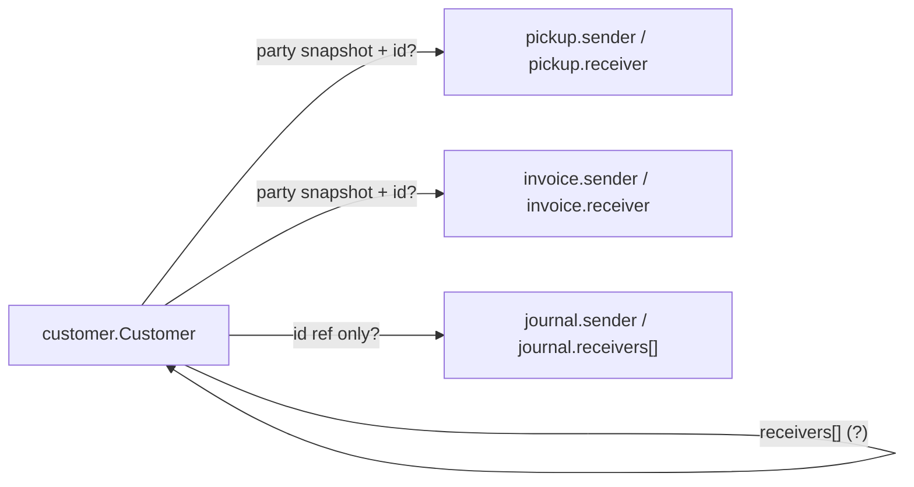

# Backend confirmation request: Customer model, relationships & API cleanup

**From:** EMSYS Portal frontend  
**Audience:** EMSYS API / backend team  
**Status:** Awaiting backend response

---

## Context

The portal verified live customer CRUD, `POST /customers/search`, and autocomplete against production (`2026-07-09`, company `64d5c0b0d1eab2aaf30b1819`). Customers are referenced across pickups, invoices, journals, and related directory flows.

Before broader API cleanup and more portal integration, we need **written confirmation** of the customer model and how it relates to transaction resources.

**Ask:** Please confirm or correct each section below (inline reply or updated OpenAPI / spec).

**Portal code references:**

- `src/lib/customers/api/customers-api.ts`
- `src/lib/orders/api/orders-api.ts`
- `src/lib/invoices/api/invoices-api.ts`
- `API_PAYLOADS.md`, `API-Query-Usage.md`

**Known portal assumption:** transaction parties hydrate address from `party.address` only (single snapshot), not the full customer `addresses[]` book. Confirm this matches server behavior.

---

## 1. Canonical `customer.Customer` read model

We believe the canonical **GET** shape is:

```txt
customer.Customer {
  id              ObjectID (24-char hex)
  name            string
  customerType    int        // 1 = Sender, 2 = Receiver — confirm
  phones[]        phone record
  email           string?
  active          bool
  IDNumber        string?
  notes           string?
  accountBalance  number?
  branch          core.BranchDTO { id, name, code }
  addresses[]     address record (primary via isPrimary)
  receivers[]     string[]   // see section 2
  createdAt       datetime
  updatedAt       datetime
  createdBy       core.User { id, name }
  updatedBy       core.User { id, name }
}
```

### Questions

| Question | Why the portal needs it |
| --- | --- |
| Is `customerType` always `1` / `2` on read and write? | Filters, branch defaults, autocomplete |
| Is `receivers[]` an array of **customer ObjectIDs**? | Portal reads it; UI to manage links is not built yet |
| Who can appear in `receivers[]` — only `customerType = 2` records? | Sender → receiver linking UX |
| Is the relationship **directional** (sender → receivers) or bidirectional? | Search, defaults on pickup / invoice |
| Is `accountBalance` authoritative or derived? | Accounting display |
| Are `createdBy` / `updatedBy` always populated on create / update? | Audit display |

---

## 2. Customer relationships across features

The portal touches customers in several places with **different shapes**. We need one documented relationship contract.



### A. `customer.receivers[]`

- Semantics: “default receivers for this sender”?
- Writable on `POST` / `PUT /customers`?
- Max cardinality? Unique? Validated against company + branch?
- Should the portal expose UI to manage this?

### B. Pickups (`/pickups`)

- Are `sender` and `receiver` **embedded party snapshots**, **refs by `id`**, or both?
- On create, if `sender.id` is sent, does the API copy current customer data or store only the ID?
- Address: is the transaction snapshot **`party.address` only** (not `party.addresses[]`)?
- Search uses `receivers.name`, `receivers.phone`, `receivers.address` but the write payload uses singular `receiver` — is that an intentional search alias?

### C. Invoices (`/invoices`)

- Same party contract as pickups?
- Is `receiver` optional?
- When customer master data changes, do historical invoices update or stay frozen?

### D. Journals / accounting (`/journals`)

- `sender: { id, name }` and `receivers: [{ id, name }]` — refs only, no full snapshot?
- Can `receivers` be multiple while pickup / invoice use a single receiver?

### E. Other resources

Please document whether these reference `customer.id` and how:

| Resource | Customer link (portal expectation) |
| --- | --- |
| Pickups | `sender`, `receiver` (party snapshot) |
| Invoices | `sender`, `receiver` (party snapshot) |
| Journals | `sender`, `receivers[]` (lighter ref?) |
| Containers | Unknown — please document |
| Deliveries | Unknown — please document |
| Routes / vehicle-routes | Unknown — please document |
| Items (catalog) | No customer link today |

---

## 3. Legacy field cleanup (deprecation timeline)

Live API still exposes legacy fields. The portal handles them for compatibility.

| Field | Current portal usage | Question for backend |
| --- | --- | --- |
| `phone1`, `phone2` | Required on create write; search OR group | Deprecated? Still required when `phones[]` is sent? |
| `address` (singular) | Fallback on read only | Remove after migration date? |
| `oldID` | Read / display legacy | Still populated for new records? |
| `createdByID` | Read if present | Replace fully by `createdBy.id`? |
| `CustomerType` (PascalCase) | Defensive read | Can we drop? |

**Requested:** deprecation matrix with **read / write / search** support per field and a target removal date.

---

## 4. Search & filter standardization

Verified working on customers:

- `GET /customers` — unfiltered list + sort
- `POST /customers/search` — bar OR search + advanced filters
- `GET /customers/autocomplete`

Please confirm as standard for list resources the portal uses today (`customers`, `pickups`, `invoices`, `employees`, `vehicles`, `containers`, `deliveries`, `journals`, etc.):

| Topic | Proposal |
| --- | --- |
| Filtered lists | Always `POST /<resource>/search` with pagination in query string |
| Unfiltered lists | `GET /<resource>?page&limit&offset&sort` |
| Single simple filter on GET | `field`, `operator`, `value` query params — still supported? |
| Bar search body | Root `operator: "and"` + inner `or` group across alias fields |
| Customer address search | Virtual paths: `address.*`, `addresses.*` — document canonical set |
| Phone search | `phones.number`, `phone1`, `phone2` — document canonical set |
| Pickup search aliases | `receivers.*` for search vs `receiver` on write — document mapping |

**Deliverable:** one shared “Advanced Search” spec applied across transaction and directory resources (not resource-specific surprises).

---

## 5. Write payload — canonical customer shape

Portal today sends on create / update:

```json
{
  "name": "...",
  "customerType": 1,
  "phone1": "+1...",
  "phones": [
    {
      "type": "mobile",
      "number": "+1...",
      "displayNumber": "...",
      "isPrimary": true
    }
  ],
  "email": "...",
  "active": true,
  "IDNumber": "...",
  "notes": "...",
  "branch": { "id": 1, "code": "NY", "name": "USA" },
  "addresses": [
    {
      "address1": "...",
      "city": "...",
      "state": "...",
      "zipcode": "...",
      "country": "US",
      "isPrimary": true
    }
  ],
  "receivers": ["..."]
}
```

### Questions

- Minimum required fields on create?
- Is `receivers` accepted and validated?
- Are address geo / verification updates only via dedicated endpoints (`PUT .../address/location`, `PUT .../address/google-verification`)?
- Idempotency / duplicate rules (name, phone, `IDNumber`)?

---

## 6. Requested deliverables from backend

1. **Written answers** to sections 1–5 (inline on this doc or linked spec).
2. **Updated API spec** (`OpenAPI` or equivalent) with:
   - canonical `customer.Customer`
   - party snapshot DTO used by pickups / invoices
   - `receivers[]` semantics on customer and journal
   - search field alias table (including pickup `receiver` vs `receivers.*`)
   - legacy deprecation notes
3. **Relationship diagram** for Customer ↔ Pickup ↔ Invoice ↔ Journal.
4. **Sample payloads** for:
   - sender with linked receivers on `customer.receivers[]`
   - pickup create referencing an existing customer + specific address
   - invoice with frozen party snapshot after customer master data changes

---

## 7. Highest-priority questions (if only three answers)

1. **What does `customer.receivers[]` mean, and is it writable?**
2. **Are pickup / invoice parties snapshots, refs, or both — and which fields are frozen?**
3. **What is the canonical search vs write naming for receiver fields (`receiver` vs `receivers.*`)?**

---

## Portal verification log

| Check | Endpoint | Result |
| --- | --- | --- |
| List | `GET /customers` | 200 |
| Create | `POST /customers` | 201 |
| Read | `GET /customers/{id}` | 200 |
| Update | `PUT /customers/{id}` | 200 |
| Delete | `DELETE /customers/{id}` | 200 |
| Bar / advanced search | `POST /customers/search` | 200 |
| Autocomplete | `GET /customers/autocomplete` | 200 |

_Filtered lists in the portal use `POST /customers/search`, not legacy GET filter params._

---

## Backend response

_Use this section for answers. Date and author optional._

| Section | Answered | Notes |
| --- | --- | --- |
| 1. Read model | | |
| 2. Relationships | | |
| 3. Legacy cleanup | | |
| 4. Search standardization | | |
| 5. Write payload | | |

---

_Update this document when the backend team responds or when API contracts change._
