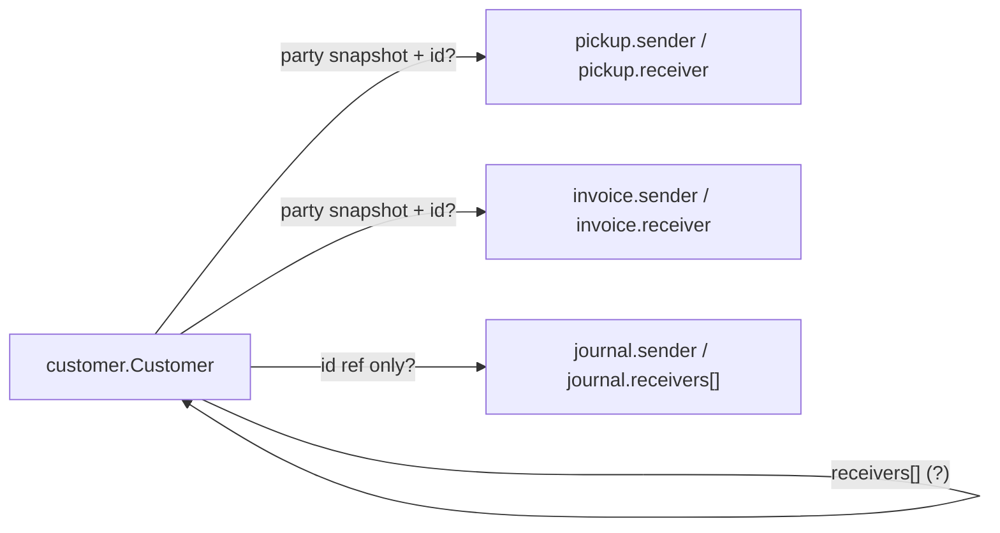

# Customer backend confirmation requests

**From:** EMSYS Portal frontend  
**Audience:** EMSYS API / backend team  
**Status:** Partially confirmed — see **Confirmed decisions** below. Remaining questions still need written answers.  
**Extracted from:** [`BACKEND_CONFIRMATION.md`](./BACKEND_CONFIRMATION.md) (Part I + customer audit decisions)  
**Related GitHub issues:** [#56](https://github.com/embarques/emsys-portal/issues/56) (account balance), [#57](https://github.com/embarques/emsys-portal/issues/57) (audit field naming)

---

## Overview

This document is the **customer-only** backend confirmation pack. Cross-resource topics (pickups, invoices, routes, etc.) remain in [`BACKEND_CONFIRMATION.md`](./BACKEND_CONFIRMATION.md).

**Shared portal code references:**

- `src/lib/customers/api/customers-api.ts`
- `src/lib/customers/types.ts`
- `src/components/customers/customers-workspace.tsx`
- `src/components/customers/customer-view-sheet.tsx`
- `API_PAYLOADS.md`, `API-Query-Usage.md`

**Audit metadata goal (customers):** list, read, and mutation responses should expose:

```txt
createdAt    datetime
updatedAt    datetime
createdBy    core.User { id, name }
updatedBy    core.User { id, name }
```

Search should allow `createdAt`, `updatedAt`, `createdBy.name`, and `updatedBy.name` (and `createdBy.id` / `updatedBy.id` where useful).

---

## Confirmed decisions (backend must implement)

### 1. Retire `createdByID` on customers

**Decision:** `createdByID` (numeric) is **deprecated** in favor of `createdBy.id` (`core.User`).

**Backend action:**

- Ensure `createdBy` / `updatedBy` are always populated on customer list + read + mutations.
- Migrate existing rows: `createdBy.id` ← legacy `createdByID` where needed.
- Mark `createdByID` deprecated in spec; remove after migration window.
- Do **not** use `user` / `employee` as creator substitutes; use `createdBy` / `updatedBy` only.
- Align UI/API naming to **Created by / Created at / Updated by / Updated at** — not “Date created / Date modified” as the field model.

### 2. Customer `receivers[]` membership

**Decision:** Only customers with **`customerType = 2` (Receiver)** may appear in `receivers[]`.

**Backend action:**

- Validate on `POST` / `PUT /customers` that every id in `receivers[]` references a Receiver customer.
- Document in OpenAPI; return clear validation error on violation.

---

## Audit gap (customers, live API `2026-07-09`)

| Resource | Endpoint | `createdAt` | `updatedAt` | `createdBy` | `updatedBy` | Portal notes |
| --- | --- | --- | --- | --- | --- | --- |
| **Customers** | `/customers` | ✅ | ✅ | ⚠️ Target: `core.User` — `createdByID` deprecated → `createdBy.id` | ⚠️ Target: `core.User` on read | Portal still maps `createdByID` only — update after backend migration |

**Legend:** ✅ present and usable · ⚠️ partial / inconsistent · ❌ missing on live read

---

## Open customer questions (also tracked as issues)

| Topic | Question | Issue |
| --- | --- | --- |
| Account balance | Is `accountBalance` authoritative/stored or derived? If derived, from what? | [#56](https://github.com/embarques/emsys-portal/issues/56) |
| Audit fields | Align API/DB/UI to `createdBy`, `createdAt`, `updatedBy`, `updatedAt` (`core.User`) | [#57](https://github.com/embarques/emsys-portal/issues/57) |

---

# Part I — Customers


## I.1 Context

Customers are referenced across pickups, invoices, journals, and related directory flows.

**Known portal assumption:** transaction parties hydrate address from `party.address` only (single snapshot), not the full customer `addresses[]` book. Confirm this matches server behavior.

---

## I.2 Canonical `customer.Customer` read model

We believe the canonical **GET** shape is:

```txt
customer.Customer {
  id              ObjectID (24-char hex)
  name            string
  customerType    int        // 1 = Sender, 2 = Receiver — confirm
  phones[]        phone record
  email           string?
  active          bool
  IDNumber        string?
  notes           string?
  accountBalance  number?
  branch          core.BranchDTO { id, name, code }
  addresses[]     address record (primary via isPrimary)
  receivers[]     string[]   // see I.3
  createdAt       datetime
  updatedAt       datetime
  createdBy       core.User { id, name }
  updatedBy       core.User { id, name }
  createdByID     number?    // **DEPRECATED** — confirmed; use createdBy.id. Migrate data, then remove.
}
```

**Backend requirement (confirmed):** `createdByID` is deprecated. Populate `createdBy` / `updatedBy` as `core.User` on all list/read/mutation responses. Migrate `createdBy.id` from legacy `createdByID` where needed.

**Portal gap (`2026-07-09`):** `customers-api.ts` still maps `createdByID` only. Portal will update after backend returns `createdBy` / `updatedBy` on live reads.

### Questions

| Question | Why the portal needs it |
| --- | --- |
| Is `customerType` always `1` / `2` on read and write? | Filters, branch defaults, autocomplete |
| Is `receivers[]` an array of **customer ObjectIDs**? | Portal reads it; UI to manage links is not built yet |
| Is the relationship **directional** (sender → receivers) or bidirectional? | Search, defaults on pickup / invoice |
| Is `accountBalance` authoritative or derived? | Accounting display |
| Are `createdBy` / `updatedBy` always populated on create / update? | Audit display |

**Confirmed:** Who can appear in `receivers[]` — only **`customerType = 2` (Receiver)** records. Backend validates on write.

---

## I.3 Customer relationships across features

The portal touches customers in several places with **different shapes**. We need one documented relationship contract.



### A. `customer.receivers[]`

- Semantics: “default receivers for this sender”
- **Confirmed:** only **`customerType = 2` (Receiver)** customers may appear in `receivers[]`
- Writable on `POST` / `PUT /customers`?
- Max cardinality? Unique? Validated against company + branch?
- Should the portal expose UI to manage this?

### B. Pickups (`/pickups`)

**Live probed `2026-07-09`** (`scripts/probe-pickups-live.mjs`, `scripts/probe-pickups-filters.mjs`, company `64d5c0b0d1eab2aaf30b1819`):

| Topic            | Live observation                                                                                      | Confirm                                                    |
| ---------------- | ----------------------------------------------------------------------------------------------------- | ---------------------------------------------------------- |
| Party shape      | `sender` / `receiver` are **embedded snapshots** on read; `sender.id` links to customer when known    | Snapshot vs ref rules on create/update                     |
| Phones           | Read: `sender.phones[]`; write: legacy `phone1` accepted                                              | Is `phone1` deprecated? Must `phones[]` be sent on update? |
| Receiver naming  | Write + read: singular `receiver`; search: `receivers.name`, `receivers.phone`, `receivers.address`   | Intentional search alias?                                  |
| Route assignment | Read: `route: { id }` (vehicle-route ObjectID, no `name`); search: `route.id eq` / `route.id eq null` | See assignment section                                     |
| Audit            | Read: `createdBy`, `updatedBy` (`core.User`); create returns `createdBy` only until first update      | `**user` retired\*\* — confirmed; `createdBy` canonical    |
| List scope       | Unfiltered `GET` and empty search imply `**completed=false**` (~168 pending vs ~2140 completed)       | Document as API contract?                                  |
| Pagination       | `total` vs `subtotal` differ (e.g. `168` / `128` on `limit=40`)                                       | Define counter semantics                                   |

**Still open:**

- On create, if `sender.id` is sent, does the API copy current customer data or store only the ID?
- Address: is the transaction snapshot `**party.address` only\*\* (not `party.addresses[]`)?
- Is `purpose` on read server-derived from `comments[]` or client-owned on write?

### C. Invoices (`/invoices`)

- Same party contract as pickups?
- Is `receiver` optional?
- When customer master data changes, do historical invoices update or stay frozen?

### D. Journals / accounting (`/journals`)

- `sender: { id, name }` and `receivers: [{ id, name }]` — refs only, no full snapshot?
- Can `receivers` be multiple while pickup / invoice use a single receiver?

### E. Other resources

Please document whether these reference `customer.id` and how:

| Resource                           | Customer link (portal expectation)                                                                                                                                          |
| ---------------------------------- | --------------------------------------------------------------------------------------------------------------------------------------------------------------------------- |
| Pickups                            | `sender`, `receiver` (party snapshot)                                                                                                                                       |
| Invoices                           | `sender`, `receiver` (party snapshot)                                                                                                                                       |
| Journals                           | `sender`, `receivers[]` (lighter ref?)                                                                                                                                      |
| Containers                         | Referenced by invoices (`container`), deliveries (`container`), vehicle-routes delivery (`container.id` + `container.number`), barcodes / labels (`container`) — see Part V |
| Deliveries                         | Unknown — please document (see Part II)                                                                                                                                     |
| Routes (`/routes`)                 | Crew + vehicle template; no customer link (see Part III)                                                                                                                    |
| Vehicle-routes (`/vehicle-routes`) | Schedule instance; references `/routes` via `route.id` (see Part II)                                                                                                        |
| Items (catalog)                    | No customer link; linked from invoice line items via `invoiceDetails.description` (portal assumption — see IV.6)                                                            |

---

## I.4 Legacy field cleanup (deprecation timeline)

Live API still exposes legacy fields. The portal handles them for compatibility.

| Field                       | Current portal usage                      | Question for backend                                                                                |
| --------------------------- | ----------------------------------------- | --------------------------------------------------------------------------------------------------- |
| `phone1`, `phone2`          | Required on create write; search OR group | Deprecated? Still required when `phones[]` is sent?                                                 |
| `address` (singular)        | Fallback on read only                     | Remove after migration date?                                                                        |
| `oldID`                     | Read / display legacy                     | Still populated for new records?                                                                    |
| `createdByID`               | Read if present                           | **DEPRECATED** — confirmed; replace with `createdBy.id`. Backend migrates data, then removes field. |
| `CustomerType` (PascalCase) | Defensive read                            | Can we drop?                                                                                        |

**Requested:** deprecation matrix with **read / write / search** support per field and a target removal date.

---

## I.5 Write payload — canonical customer shape

Portal today sends on create / update:

```json
{
  "name": "...",
  "customerType": 1,
  "phone1": "+1...",
  "phones": [
    {
      "type": "mobile",
      "number": "+1...",
      "displayNumber": "...",
      "isPrimary": true
    }
  ],
  "email": "...",
  "active": true,
  "IDNumber": "...",
  "notes": "...",
  "branch": { "id": 1, "code": "NY", "name": "USA" },
  "addresses": [
    {
      "address1": "...",
      "city": "...",
      "state": "...",
      "zipcode": "...",
      "country": "US",
      "isPrimary": true
    }
  ],
  "receivers": ["..."]
}
```

### Questions

- Minimum required fields on create?
- Is `receivers` accepted and validated?
- Are address geo / verification updates only via dedicated endpoints (`PUT .../address/location`, `PUT .../address/google-verification`)?
- Idempotency / duplicate rules (name, phone, `IDNumber`)?

---


---

# Portal verification log

## Customers

| Check                                   | Endpoint                      | Result                                                                                                                |
| --------------------------------------- | ----------------------------- | --------------------------------------------------------------------------------------------------------------------- |
| List                                    | `GET /customers`              | 200                                                                                                                   |
| Create                                  | `POST /customers`             | 201                                                                                                                   |
| Read                                    | `GET /customers/{id}`         | 200                                                                                                                   |
| Update                                  | `PUT /customers/{id}`         | 200                                                                                                                   |
| Delete                                  | `DELETE /customers/{id}`      | 200                                                                                                                   |
| Bar / advanced search                   | `POST /customers/search`      | 200                                                                                                                   |
| Autocomplete                            | `GET /customers/autocomplete` | 200                                                                                                                   |
| Audit `createdBy` / `updatedBy` on read | list / GET                    | **Pending backend migration** — `createdByID` deprecated (confirmed); target `createdBy` / `updatedBy` as `core.User` |


---

## Ask

Please confirm or correct each **open** section above (inline reply, updated OpenAPI / spec, or comments on the tracking GitHub issue). After confirmation, the portal will update `customers-api.ts` and customer directory/view UI to match.
